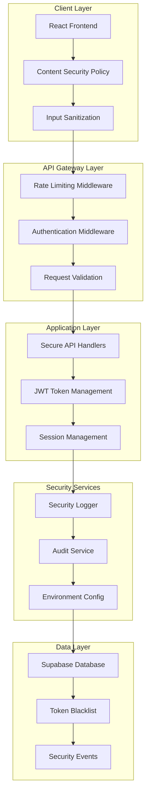

# Design Document

## Overview

This design document outlines the comprehensive security remediation strategy for the Maritime Onboarding System. The solution addresses critical XSS vulnerabilities, implements robust rate limiting, strengthens JWT security, and establishes enterprise-grade security practices across the application.

The design follows a layered security approach with defense-in-depth principles, ensuring multiple security controls protect against various attack vectors while maintaining system performance and user experience.

## Architecture

### Security Architecture Overview



### Security Control Flow

1. **Request Ingress**: All requests pass through CSP validation and input sanitization
2. **Rate Limiting**: Global and endpoint-specific rate limiting prevents abuse
3. **Authentication**: Enhanced JWT validation with token binding and blacklist checking
4. **Authorization**: Role-based access control with session management
5. **Processing**: Secure handlers with comprehensive error handling
6. **Audit**: All security events logged and monitored
7. **Response**: Sanitized responses with security headers

## Components and Interfaces

### 1. XSS Prevention System

#### SafeContentRenderer Component
```javascript
interface SafeContentRenderer {
  // Replaces all innerHTML and dangerouslySetInnerHTML usage
  sanitizeAndRender(content: string, options?: SanitizationOptions): ReactElement
  validateContent(content: string): ValidationResult
  detectXSSAttempts(content: string): XSSDetectionResult
}

interface SanitizationOptions {
  allowedTags: string[]
  allowedAttributes: string[]
  allowedSchemes: string[]
  maxLength: number
}
```

#### Enhanced DOMPurify Integration
```javascript
interface SecureDOMPurify {
  sanitizeHTML(input: string, config: DOMPurifyConfig): string
  sanitizeCSS(input: string): string
  validateSafeContent(content: string): boolean
  logXSSAttempts(content: string, source: string): void
}
```

### 2. Rate Limiting System

#### Global Rate Limiter
```javascript
interface GlobalRateLimiter {
  // Middleware for all API endpoints
  middleware(options: RateLimitOptions): ExpressMiddleware
  
  // Endpoint-specific rate limiting
  createEndpointLimiter(endpoint: string, options: RateLimitOptions): RateLimiter
  
  // Rate limit management
  clearRateLimit(key: string): Promise<boolean>
  getRateLimitStatus(key: string): Promise<RateLimitStatus>
  
  // Violation handling
  handleViolation(req: Request, violation: RateLimitViolation): Promise<void>
}

interface RateLimitOptions {
  windowMs: number
  maxRequests: number
  keyGenerator: (req: Request) => string
  skipConditions?: (req: Request) => boolean
  violationHandler?: (req: Request, res: Response) => void
}
```

#### Rate Limit Store Interface
```javascript
interface RateLimitStore {
  get(key: string): Promise<RateLimitData | null>
  set(key: string, data: RateLimitData, ttlMs: number): Promise<boolean>
  delete(key: string): Promise<boolean>
  clear(): Promise<boolean>
}

// Implementations: MemoryRateLimitStore, RedisRateLimitStore
```

### 3. Enhanced JWT Security

#### Secure Token Manager
```javascript
interface SecureTokenManager {
  // Token generation with enhanced security
  generateToken(user: User, options?: TokenOptions): Promise<TokenResult>
  
  // Token validation with binding
  validateToken(token: string, bindingData?: TokenBinding): Promise<ValidationResult>
  
  // Token refresh and rotation
  refreshToken(refreshToken: string): Promise<TokenResult>
  
  // Token blacklisting
  blacklistToken(token: string, reason: string): Promise<boolean>
  
  // Token binding for theft prevention
  bindToken(token: string, bindingData: TokenBinding): Promise<boolean>
}

interface TokenOptions {
  expiresIn: string // Max 2 hours
  audience: string
  issuer: string
  binding: TokenBinding
}

interface TokenBinding {
  ipAddress: string
  userAgent: string
  deviceFingerprint?: string
}
```

### 4. Password Security Enhancement

#### Enhanced Password Validator
```javascript
interface EnhancedPasswordValidator {
  validatePassword(password: string, context: ValidationContext): ValidationResult
  calculateEntropy(password: string): number
  checkPasswordHistory(userId: string, password: string): Promise<boolean>
  generatePasswordRequirements(): PasswordRequirements
}

interface ValidationContext {
  userId?: string
  email?: string
  firstName?: string
  lastName?: string
}

interface PasswordRequirements {
  minLength: number
  maxLength: number
  minEntropy: number
  requireUppercase: boolean
  requireLowercase: boolean
  requireNumbers: boolean
  requireSpecialChars: boolean
  specialChars: string
  blacklistedPasswords: string[]
  historyCount: number
}
```

### 5. Environment Configuration Security

#### Secure Configuration Manager
```javascript
interface SecureConfigManager {
  // Configuration validation
  validateEnvironment(): Promise<ValidationResult>
  
  // Secure environment access
  getSecureConfig(key: string): any
  
  // Configuration masking for logs
  maskSensitiveConfig(config: object): object
  
  // Runtime configuration checks
  performRuntimeChecks(): Promise<HealthCheckResult>
}

interface ConfigValidation {
  required: string[]
  optional: string[]
  validators: Record<string, (value: any) => boolean>
  transformers: Record<string, (value: any) => any>
}
```

### 6. Security Audit System

#### Comprehensive Security Logger
```javascript
interface SecurityAuditLogger {
  // Authentication events
  logAuthenticationEvent(event: AuthEvent): Promise<void>
  
  // Authorization failures
  logAuthorizationFailure(event: AuthzEvent): Promise<void>
  
  // Security violations
  logSecurityViolation(event: SecurityEvent): Promise<void>
  
  // Rate limit violations
  logRateLimitViolation(event: RateLimitEvent): Promise<void>
  
  // XSS attempts
  logXSSAttempt(event: XSSEvent): Promise<void>
  
  // File upload security events
  logFileSecurityEvent(event: FileSecurityEvent): Promise<void>
}

interface SecurityEvent {
  eventId: string
  type: SecurityEventType
  severity: 'low' | 'medium' | 'high' | 'critical'
  userId?: string
  ipAddress: string
  userAgent: string
  details: object
  threats: string[]
  timestamp: Date
}
```

### 7. File Upload Security

#### Secure File Processor
```javascript
interface SecureFileProcessor {
  // File validation
  validateFile(file: UploadedFile, type: FileType): Promise<ValidationResult>
  
  // Malware scanning
  scanForMalware(file: UploadedFile): Promise<ScanResult>
  
  // Content analysis
  analyzeFileContent(file: UploadedFile): Promise<ContentAnalysis>
  
  // File sanitization
  sanitizeFile(file: UploadedFile): Promise<SanitizedFile>
  
  // Quarantine management
  quarantineFile(file: UploadedFile, reason: string): Promise<boolean>
}

interface FileValidation {
  mimeTypeValidation: boolean
  magicByteValidation: boolean
  sizeValidation: boolean
  contentValidation: boolean
  malwareCheck: boolean
}
```

### 8. Session Management

#### Enhanced Session Manager
```javascript
interface EnhancedSessionManager {
  // Session creation and tracking
  createSession(user: User, request: Request): Promise<Session>
  
  // Session validation
  validateSession(sessionId: string): Promise<SessionValidation>
  
  // Concurrent session management
  manageConcurrentSessions(userId: string): Promise<void>
  
  // Session invalidation
  invalidateSession(sessionId: string, reason: string): Promise<boolean>
  invalidateAllUserSessions(userId: string, reason: string): Promise<number>
  
  // Suspicious activity detection
  detectSuspiciousActivity(session: Session): Promise<SuspiciousActivityResult>
}

interface Session {
  id: string
  userId: string
  ipAddress: string
  userAgent: string
  createdAt: Date
  lastActivity: Date
  isActive: boolean
  deviceFingerprint?: string
}
```

## Data Models

### Security Events Schema
```sql
CREATE TABLE security_events (
  id UUID PRIMARY KEY DEFAULT gen_random_uuid(),
  event_id VARCHAR(255) UNIQUE NOT NULL,
  type VARCHAR(100) NOT NULL,
  severity VARCHAR(20) NOT NULL,
  user_id UUID REFERENCES users(id),
  ip_address INET,
  user_agent TEXT,
  details JSONB,
  threats TEXT[],
  created_at TIMESTAMP WITH TIME ZONE DEFAULT NOW(),
  
  INDEX idx_security_events_type (type),
  INDEX idx_security_events_severity (severity),
  INDEX idx_security_events_user_id (user_id),
  INDEX idx_security_events_created_at (created_at)
);
```

### Enhanced Token Blacklist Schema
```sql
CREATE TABLE token_blacklist (
  id UUID PRIMARY KEY DEFAULT gen_random_uuid(),
  token_jti VARCHAR(255) UNIQUE NOT NULL,
  user_id UUID REFERENCES users(id),
  token_hash VARCHAR(255) NOT NULL,
  reason VARCHAR(100) NOT NULL,
  ip_address INET,
  user_agent TEXT,
  expires_at TIMESTAMP WITH TIME ZONE NOT NULL,
  created_at TIMESTAMP WITH TIME ZONE DEFAULT NOW(),
  
  INDEX idx_token_blacklist_jti (token_jti),
  INDEX idx_token_blacklist_user_id (user_id),
  INDEX idx_token_blacklist_expires_at (expires_at)
);
```

### Password History Schema
```sql
CREATE TABLE password_history (
  id UUID PRIMARY KEY DEFAULT gen_random_uuid(),
  user_id UUID REFERENCES users(id) NOT NULL,
  password_hash VARCHAR(255) NOT NULL,
  created_at TIMESTAMP WITH TIME ZONE DEFAULT NOW(),
  
  INDEX idx_password_history_user_id (user_id),
  INDEX idx_password_history_created_at (created_at)
);
```

### Session Tracking Schema
```sql
CREATE TABLE user_sessions (
  id UUID PRIMARY KEY DEFAULT gen_random_uuid(),
  user_id UUID REFERENCES users(id) NOT NULL,
  session_token VARCHAR(255) UNIQUE NOT NULL,
  ip_address INET,
  user_agent TEXT,
  device_fingerprint VARCHAR(255),
  is_active BOOLEAN DEFAULT true,
  last_activity TIMESTAMP WITH TIME ZONE DEFAULT NOW(),
  created_at TIMESTAMP WITH TIME ZONE DEFAULT NOW(),
  expires_at TIMESTAMP WITH TIME ZONE NOT NULL,
  
  INDEX idx_user_sessions_user_id (user_id),
  INDEX idx_user_sessions_token (session_token),
  INDEX idx_user_sessions_active (is_active),
  INDEX idx_user_sessions_expires_at (expires_at)
);
```

### Rate Limit Tracking Schema
```sql
CREATE TABLE rate_limit_violations (
  id UUID PRIMARY KEY DEFAULT gen_random_uuid(),
  ip_address INET NOT NULL,
  endpoint VARCHAR(255) NOT NULL,
  method VARCHAR(10) NOT NULL,
  user_id UUID REFERENCES users(id),
  violation_count INTEGER NOT NULL,
  window_start TIMESTAMP WITH TIME ZONE NOT NULL,
  window_end TIMESTAMP WITH TIME ZONE NOT NULL,
  created_at TIMESTAMP WITH TIME ZONE DEFAULT NOW(),
  
  INDEX idx_rate_limit_violations_ip (ip_address),
  INDEX idx_rate_limit_violations_endpoint (endpoint),
  INDEX idx_rate_limit_violations_created_at (created_at)
);
```

## Error Handling

### Secure Error Response System

#### Error Sanitization
```javascript
interface SecureErrorHandler {
  // Sanitize errors for client response
  sanitizeError(error: Error, context: ErrorContext): ClientError
  
  // Log detailed errors server-side
  logDetailedError(error: Error, context: ErrorContext): Promise<void>
  
  // Generate generic error responses
  generateGenericResponse(errorType: ErrorType): ClientError
  
  // Handle security-related errors
  handleSecurityError(error: SecurityError, context: ErrorContext): SecurityErrorResponse
}

interface ErrorContext {
  userId?: string
  ipAddress: string
  userAgent: string
  endpoint: string
  method: string
  timestamp: Date
}

interface ClientError {
  error: string
  message: string
  code?: string
  timestamp: Date
}
```

#### Error Classification
- **Public Errors**: Safe to expose to clients (validation errors, not found)
- **Internal Errors**: Logged server-side only (database errors, system failures)
- **Security Errors**: Trigger additional security logging and monitoring

## Testing Strategy

### Security Testing Framework

#### Automated Security Tests
1. **XSS Prevention Tests**
   - Test all input fields with XSS payloads
   - Verify DOMPurify sanitization
   - Test content rendering components

2. **Rate Limiting Tests**
   - Test rate limit enforcement
   - Verify rate limit headers
   - Test rate limit bypass attempts

3. **JWT Security Tests**
   - Test token validation
   - Test token blacklisting
   - Test token binding

4. **Password Security Tests**
   - Test password complexity validation
   - Test password history enforcement
   - Test entropy calculations

#### Penetration Testing Scenarios
1. **XSS Attack Simulation**
   - Stored XSS attempts
   - Reflected XSS attempts
   - DOM-based XSS attempts

2. **Authentication Bypass Attempts**
   - JWT token manipulation
   - Session hijacking attempts
   - Privilege escalation attempts

3. **Rate Limiting Bypass**
   - IP rotation attacks
   - Distributed attacks
   - Header manipulation

#### Security Regression Testing
- Automated security test suite in CI/CD
- Regular dependency vulnerability scanning
- Periodic security code reviews

### Performance Testing

#### Security Overhead Measurement
1. **Rate Limiting Performance**
   - Measure middleware overhead
   - Test under high load
   - Memory usage monitoring

2. **JWT Validation Performance**
   - Token validation latency
   - Blacklist check performance
   - Database query optimization

3. **Content Sanitization Performance**
   - DOMPurify processing time
   - Large content handling
   - Memory usage patterns

## Implementation Phases

### Phase 1: Critical Security Fixes (Weeks 1-2)

#### Week 1: XSS Elimination
- Replace all innerHTML usage with SafeContentRenderer
- Remove dangerouslySetInnerHTML usage
- Implement comprehensive DOMPurify integration
- Add XSS attempt detection and logging

#### Week 1-2: Rate Limiting Implementation
- Implement global rate limiting middleware
- Add endpoint-specific rate limiters
- Create rate limit violation logging
- Add rate limit management APIs

#### Week 1-2: JWT Security Enhancement
- Reduce token expiration to 2 hours
- Implement token binding
- Add refresh token rotation
- Enhance blacklist checking with fail-secure defaults

### Phase 2: Security Hardening (Weeks 3-4)

#### Week 3: Password Security & Environment Configuration
- Implement enhanced password validation
- Add password history tracking
- Create centralized environment configuration
- Add environment validation at startup

#### Week 3-4: Audit Logging & File Upload Security
- Implement comprehensive security event logging
- Add security monitoring dashboard
- Enhance file upload validation
- Add malware scanning integration

#### Week 4: Error Handling & Session Management
- Implement secure error handling
- Add session tracking and management
- Implement concurrent session limits
- Add suspicious activity detection

### Phase 3: Compliance & Automation (Weeks 5-6)

#### Week 5: Dependency Management & Security Headers
- Update all vulnerable dependencies
- Implement automated dependency scanning
- Strengthen security headers configuration
- Add CSP violation monitoring

#### Week 6: Security Testing Automation
- Integrate SAST tools in CI/CD
- Add automated security regression tests
- Implement security monitoring alerts
- Create security incident response procedures

## Security Monitoring and Alerting

### Real-time Security Monitoring
1. **Rate Limit Violations**: Alert on excessive rate limit violations
2. **XSS Attempts**: Immediate alerts for XSS attempt detection
3. **Authentication Failures**: Monitor for brute force attempts
4. **Suspicious File Uploads**: Alert on malware detection
5. **Token Abuse**: Monitor for token manipulation attempts

### Security Metrics Dashboard
- Security event trends
- Rate limiting effectiveness
- Authentication success/failure rates
- File upload security statistics
- Dependency vulnerability status

### Incident Response Integration
- Automated security incident creation
- Integration with security team workflows
- Escalation procedures for critical events
- Forensic data collection and preservation