# APPENDIX B: DATA FLOW DIAGRAMS
## Maritime Onboarding System 2025
### System Data Processing and Security Architecture

---

## EXECUTIVE SUMMARY

This appendix provides comprehensive data flow diagrams illustrating how data moves through the Maritime Onboarding System. Each diagram shows data processing points, security controls, and compliance checkpoints to ensure full transparency of data handling.

---

## 1. HIGH-LEVEL SYSTEM ARCHITECTURE

---

## 2. AUTHENTICATION FLOW

### 2.1 Admin/Manager Password Authentication

### 2.2 Crew Magic Link Authentication

---

## 3. DATA PROCESSING FLOWS

### 3.1 Training Content Delivery

### 3.2 Quiz Submission and Scoring

---

## 4. DATA STORAGE AND ENCRYPTION

### 4.1 Encryption Layers

### 4.2 Backup and Recovery Flow

---

## 5. GDPR DATA FLOWS

### 5.1 Data Subject Request Processing

### 5.2 Data Retention and Deletion

---

## 6. SECURITY MONITORING FLOWS

### 6.1 Threat Detection Pipeline

### 6.2 Incident Response Flow

---

## 7. INTEGRATION FLOWS

### 7.1 Email Service Integration

### 7.2 Certificate Generation Flow

---

## 8. COMPLIANCE CHECKPOINTS

### 8.1 Data Processing Compliance Map

```mermaid
graph TB
    subgraph "Data Entry Points"
        E1[User Registration]
        E2[Training Data]
        E3[Quiz Responses]
        E4[File Uploads]
    end
    
    subgraph "Compliance Checks"
        C1{GDPR Consent?}
        C2{Data Minimization?}
        C3{Purpose Limitation?}
        C4{Retention Policy?}
        C5{Encryption Active?}
        C6{Audit Logged?}
    end
    
    subgraph "Processing"
        P1[Process Data]
        P2[Store Data]
        P3[Transfer Data]
    end
    
    subgraph "Controls"
        ACCEPT[✓ Accept]
        REJECT[✗ Reject]
    end
    
    E1 --> C1
    E2 --> C1
    E3 --> C1
    E4 --> C1
    
    C1 -->|Yes| C2
    C1 -->|No| REJECT
    
    C2 -->|Yes| C3
    C2 -->|No| REJECT
    
    C3 -->|Yes| C4
    C3 -->|No| REJECT
    
    C4 -->|Yes| C5
    C4 -->|No| REJECT
    
    C5 -->|Yes| C6
    C5 -->|No| REJECT
    
    C6 -->|Yes| ACCEPT
    C6 -->|No| REJECT
    
    ACCEPT --> P1
    P1 --> P2
    P2 --> P3
```

---

## 9. NETWORK ARCHITECTURE

### 9.1 Network Security Zones

---

## 10. DATA LIFECYCLE MANAGEMENT

### 10.1 Complete Data Lifecycle

---

## DIAGRAM LEGEND

### Symbols and Notation

| Symbol | Meaning |
|--------|---------|
| `[Component]` | System Component |
| `(Database)` | Data Storage |
| `{Decision}` | Decision Point |
| `-->` | Data Flow |
| `-.->` | Control/Monitor Flow |
| `==>` | Encrypted Flow |
| `--x` | Blocked/Failed |
| `✓` | Approved/Valid |
| `✗` | Rejected/Invalid |

### Security Levels

| Color | Security Level |
|-------|---------------|
| 🟢 Green | Secure/Encrypted |
| 🟡 Yellow | Monitored |
| 🔴 Red | Blocked/Alert |
| 🔵 Blue | Public/CDN |

### Compliance Indicators

| Indicator | Meaning |
|-----------|---------|
| GDPR | GDPR Compliant |
| ISO | ISO 27001 Control |
| LOG | Audit Logged |
| ENC | Encrypted |
| MFA | MFA Protected |

---

## NOTES

1. **All data flows** within EU boundaries (Frankfurt region)
2. **All transmissions** use TLS 1.3 minimum
3. **All storage** uses AES-256-GCM encryption
4. **All actions** create audit log entries
5. **All sensitive operations** require authentication
6. **All high-privilege actions** require MFA

---

*These data flow diagrams are maintained by the Security Architecture team and updated with any system changes. Last update: January 2025*