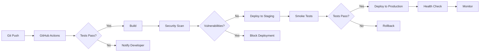

# APPENDIX C: TECHNICAL ARCHITECTURE DOCUMENTATION
## Maritime Onboarding System 2025
### Complete System Architecture and Technical Specifications

---

## EXECUTIVE SUMMARY

This document provides comprehensive technical architecture documentation for the Maritime Onboarding System, including infrastructure design, technology stack, security architecture, and integration specifications required for enterprise deployment and compliance verification.

---

## 1. SYSTEM ARCHITECTURE OVERVIEW

### 1.1 Architecture Principles

| Principle | Description | Implementation |
|-----------|-------------|----------------|
| **Security by Design** | Security embedded at every layer | Multi-layer encryption, RBAC, MFA |
| **Data Sovereignty** | EU data residency | Frankfurt region only |
| **Scalability** | Horizontal and vertical scaling | Serverless, auto-scaling |
| **Resilience** | High availability and fault tolerance | Multi-region, redundancy |
| **Compliance First** | GDPR and maritime regulations | Privacy by design |
| **API-First** | RESTful service architecture | OpenAPI specification |
| **Cloud Native** | Designed for cloud deployment | Serverless functions |
| **Zero Trust** | Never trust, always verify | Continuous authentication |

### 1.2 High-Level Architecture

```
┌─────────────────────────────────────────────────────────────┐
│                         USERS                               │
│  ┌──────────┐  ┌──────────┐  ┌──────────┐  ┌──────────┐  │
│  │  Admin   │  │ Manager  │  │   Crew   │  │ Auditor  │  │
│  └────┬─────┘  └────┬─────┘  └────┬─────┘  └────┬─────┘  │
└───────┼─────────────┼─────────────┼─────────────┼─────────┘
        │             │             │             │
        ▼             ▼             ▼             ▼
┌─────────────────────────────────────────────────────────────┐
│                    PRESENTATION LAYER                       │
│  ┌────────────────────────────────────────────────────┐   │
│  │         React SPA (CDN - Vercel Edge Network)      │   │
│  │  - Components  - Routes  - State  - Services       │   │
│  └────────────────────────────────────────────────────┘   │
└─────────────────────────────────────────────────────────────┘
                              │
                              ▼
┌─────────────────────────────────────────────────────────────┐
│                     APPLICATION LAYER                       │
│  ┌────────────────────────────────────────────────────┐   │
│  │        Vercel Serverless Functions (Node.js)       │   │
│  │  - API Routes  - Business Logic  - Middleware      │   │
│  └────────────────────────────────────────────────────┘   │
└─────────────────────────────────────────────────────────────┘
                              │
                              ▼
┌─────────────────────────────────────────────────────────────┐
│                      DATA LAYER                            │
│  ┌──────────────────┐  ┌──────────────────────────────┐  │
│  │  PostgreSQL      │  │  Object Storage              │  │
│  │  (Supabase)      │  │  (Supabase Storage)         │  │
│  └──────────────────┘  └──────────────────────────────┘  │
└─────────────────────────────────────────────────────────────┘
                              │
                              ▼
┌─────────────────────────────────────────────────────────────┐
│                   EXTERNAL SERVICES                        │
│  ┌──────────────┐  ┌──────────────┐  ┌──────────────┐   │
│  │ MailerSend   │  │ TOTP Service │  │ Monitoring   │   │
│  │ (Email)      │  │ (MFA)        │  │ (Logs)       │   │
│  └──────────────┘  └──────────────┘  └──────────────┘   │
└─────────────────────────────────────────────────────────────┘
```

---

## 2. TECHNOLOGY STACK

### 2.1 Frontend Technologies

| Component | Technology | Version | Purpose |
|-----------|------------|---------|---------|
| **Framework** | React | 18.2.0 | UI framework |
| **Language** | JavaScript/JSX | ES6+ | Programming language |
| **Routing** | React Router | 6.x | Client-side routing |
| **State Management** | Context API | Built-in | Global state |
| **Styling** | Tailwind CSS | 3.x | Utility-first CSS |
| **Build Tool** | Vite | 5.x | Fast build system |
| **Package Manager** | npm | 10.x | Dependency management |
| **HTTP Client** | Axios | 1.6.x | API communication |
| **Internationalization** | i18next | 23.x | Multi-language support |
| **PDF Generation** | pdf-lib | 1.17.x | Certificate creation |
| **QR Codes** | qrcode | 1.5.x | Verification codes |

### 2.2 Backend Technologies

| Component | Technology | Version | Purpose |
|-----------|------------|---------|---------|
| **Runtime** | Node.js | 20.x LTS | Server runtime |
| **Framework** | Vercel Functions | Latest | Serverless functions |
| **Database** | PostgreSQL | 15.x | Primary database |
| **ORM/Query** | Supabase Client | 2.x | Database access |
| **Authentication** | JWT | RFC 7519 | Token-based auth |
| **Encryption** | crypto (native) | Built-in | Cryptographic operations |
| **MFA** | speakeasy | 2.x | TOTP generation |
| **Email** | MailerSend SDK | 2.x | Email service |
| **Validation** | Joi | 17.x | Input validation |
| **Security** | bcrypt | 5.x | Password hashing |
| **Rate Limiting** | Custom | N/A | Request throttling |

### 2.3 Infrastructure Stack

| Component | Provider | Service | Location |
|-----------|----------|---------|----------|
| **Application Hosting** | Vercel | Pro Plan | Frankfurt, EU |
| **Database Hosting** | Supabase | Pro Plan | Frankfurt, EU |
| **CDN** | Vercel Edge | Global | EU PoPs |
| **Email Service** | MailerSend | Business | EU Region |
| **DNS** | Cloudflare | Pro | Global |
| **Monitoring** | Vercel Analytics | Included | EU Processing |
| **Backup Storage** | Supabase | Included | Frankfurt, EU |

---

## 3. DATABASE ARCHITECTURE

### 3.1 Database Schema Overview

```sql
-- Core Tables Structure
┌─────────────────┐     ┌─────────────────┐     ┌─────────────────┐
│     users       │────<│  crew_members   │>────│   workflows     │
└─────────────────┘     └─────────────────┘     └─────────────────┘
         │                       │                        │
         │                       │                        │
         ▼                       ▼                        ▼
┌─────────────────┐     ┌─────────────────┐     ┌─────────────────┐
│  magic_links    │     │training_progress│     │ workflow_phases │
└─────────────────┘     └─────────────────┘     └─────────────────┘
         │                       │                        │
         │                       │                        │
         ▼                       ▼                        ▼
┌─────────────────┐     ┌─────────────────┐     ┌─────────────────┐
│token_blacklist  │     │ quiz_attempts   │     │training_content │
└─────────────────┘     └─────────────────┘     └─────────────────┘
         │                       │                        │
         │                       │                        │
         ▼                       ▼                        ▼
┌─────────────────┐     ┌─────────────────┐     ┌─────────────────┐
│ security_events │     │  certificates   │     │   audit_logs    │
└─────────────────┘     └─────────────────┘     └─────────────────┘
```

### 3.2 Key Database Tables

#### Users Table
```sql
CREATE TABLE users (
    id BIGSERIAL PRIMARY KEY,
    email VARCHAR(255) UNIQUE NOT NULL,
    password_hash VARCHAR(255),
    role VARCHAR(50) NOT NULL CHECK (role IN ('admin', 'manager', 'crew')),
    company_id BIGINT,
    status VARCHAR(50) DEFAULT 'active',
    is_active BOOLEAN DEFAULT true,
    mfa_required BOOLEAN DEFAULT false,
    failed_login_attempts INTEGER DEFAULT 0,
    locked_until TIMESTAMPTZ,
    last_login TIMESTAMPTZ,
    created_at TIMESTAMPTZ DEFAULT NOW(),
    updated_at TIMESTAMPTZ DEFAULT NOW()
);

-- Indexes for performance
CREATE INDEX idx_users_email ON users(email);
CREATE INDEX idx_users_company ON users(company_id);
CREATE INDEX idx_users_role ON users(role);
```

#### Security Events Table
```sql
CREATE TABLE security_events (
    id BIGSERIAL PRIMARY KEY,
    event_id VARCHAR(255) UNIQUE NOT NULL,
    type VARCHAR(100) NOT NULL,
    severity VARCHAR(20) CHECK (severity IN ('LOW', 'MEDIUM', 'HIGH', 'CRITICAL')),
    user_id BIGINT REFERENCES users(id),
    ip_address INET,
    user_agent TEXT,
    details JSONB,
    threats TEXT[],
    response_actions JSONB,
    created_at TIMESTAMPTZ DEFAULT NOW()
);

-- Indexes for analysis
CREATE INDEX idx_security_events_type ON security_events(type);
CREATE INDEX idx_security_events_severity ON security_events(severity);
CREATE INDEX idx_security_events_user ON security_events(user_id);
CREATE INDEX idx_security_events_created ON security_events(created_at);
```

### 3.3 Row Level Security (RLS) Policies

```sql
-- Enable RLS on all tables
ALTER TABLE users ENABLE ROW LEVEL SECURITY;
ALTER TABLE crew_members ENABLE ROW LEVEL SECURITY;
ALTER TABLE training_progress ENABLE ROW LEVEL SECURITY;

-- Company isolation policy
CREATE POLICY company_isolation ON crew_members
    FOR ALL
    USING (company_id = current_setting('app.company_id')::BIGINT);

-- User data access policy
CREATE POLICY user_data_access ON training_progress
    FOR SELECT
    USING (
        crew_member_id IN (
            SELECT id FROM crew_members 
            WHERE company_id = current_setting('app.company_id')::BIGINT
        )
    );

-- Admin full access policy
CREATE POLICY admin_full_access ON ALL TABLES
    FOR ALL
    USING (
        EXISTS (
            SELECT 1 FROM users 
            WHERE id = current_setting('app.user_id')::BIGINT 
            AND role = 'admin'
        )
    );
```

---

## 4. API ARCHITECTURE

### 4.1 API Structure

```
/api
├── /auth
│   ├── admin-login.js       [POST]   Admin/Manager authentication
│   ├── login-with-mfa.js    [POST]   MFA-enhanced login
│   ├── magic-login.js       [GET]    Magic link validation
│   ├── request-magic-link.js [POST]  Magic link generation
│   ├── logout.js            [POST]   Session termination
│   └── verify.js            [GET]    Token verification
│
├── /admin
│   ├── stats.js             [GET]    System statistics
│   ├── audit-log.js         [GET]    Audit trail access
│   ├── system-settings.js   [GET/PUT] System configuration
│   └── feature-flags.js     [GET/PUT] Feature management
│
├── /manager
│   ├── crew-list.js         [GET]    Crew roster
│   ├── assign-training.js   [POST]   Training assignment
│   ├── progress-report.js   [GET]    Progress analytics
│   └── content-management.js [CRUD]   Content operations
│
├── /crew
│   ├── profile.js           [GET/PUT] Profile management
│   ├── training-content.js  [GET]    Content delivery
│   ├── submit-quiz.js       [POST]   Quiz submission
│   └── certificate.js       [GET]    Certificate retrieval
│
├── /pdf
│   ├── generate-certificate.js [POST] Certificate creation
│   └── verify-certificate.js   [GET]  Certificate validation
│
└── /email
    ├── send-notification.js  [POST]   Notification dispatch
    └── template-preview.js   [GET]    Template preview
```

### 4.2 API Security Middleware Stack

```javascript
// Middleware execution order
app.use(corsMiddleware);           // CORS configuration
app.use(rateLimiter);             // Rate limiting
app.use(securityHeaders);         // Security headers
app.use(requestLogger);           // Request logging
app.use(authMiddleware);          // JWT validation
app.use(roleMiddleware);          // Role verification
app.use(companyIsolation);        // Multi-tenancy
app.use(inputValidation);         // Input sanitization
app.use(apiHandler);              // Business logic
app.use(responseFormatter);       // Response formatting
app.use(errorHandler);            // Error handling
app.use(auditLogger);             // Audit logging
```

### 4.3 API Response Standards

```javascript
// Success Response
{
    "success": true,
    "data": {
        // Response payload
    },
    "metadata": {
        "timestamp": "2025-01-15T10:30:00Z",
        "version": "1.0",
        "requestId": "req_123456"
    }
}

// Error Response
{
    "success": false,
    "error": {
        "code": "AUTH_INVALID_TOKEN",
        "message": "Invalid authentication token",
        "details": {
            // Additional error context
        }
    },
    "metadata": {
        "timestamp": "2025-01-15T10:30:00Z",
        "requestId": "req_123456"
    }
}
```

---

## 5. SECURITY ARCHITECTURE

### 5.1 Security Layers

```
┌──────────────────────────────────────────────────────┐
│                   LAYER 7: Application               │
│  - Input validation      - Business logic security   │
│  - Session management    - Error handling            │
└──────────────────────────────────────────────────────┘
                            ▲
┌──────────────────────────────────────────────────────┐
│                   LAYER 6: Presentation              │
│  - XSS protection        - CSRF tokens               │
│  - Content Security Policy - Frame options           │
└──────────────────────────────────────────────────────┘
                            ▲
┌──────────────────────────────────────────────────────┐
│                   LAYER 5: Session                   │
│  - JWT tokens            - Token blacklisting        │
│  - Session timeout       - Concurrent session control│
└──────────────────────────────────────────────────────┘
                            ▲
┌──────────────────────────────────────────────────────┐
│                   LAYER 4: Transport                 │
│  - TLS 1.3              - Certificate pinning        │
│  - HSTS                 - Encrypted payloads         │
└──────────────────────────────────────────────────────┘
                            ▲
┌──────────────────────────────────────────────────────┐
│                   LAYER 3: Network                   │
│  - Firewall rules       - DDoS protection           │
│  - Rate limiting        - IP whitelisting           │
└──────────────────────────────────────────────────────┘
                            ▲
┌──────────────────────────────────────────────────────┐
│                   LAYER 2: Data Link                 │
│  - VPC isolation        - Network segmentation      │
│  - Private subnets      - Security groups           │
└──────────────────────────────────────────────────────┘
                            ▲
┌──────────────────────────────────────────────────────┐
│                   LAYER 1: Physical                  │
│  - Data center security - Physical access control    │
│  - Environmental controls - Hardware security        │
└──────────────────────────────────────────────────────┘
```

### 5.2 Authentication & Authorization Matrix

| User Type | Auth Method | MFA | Session Duration | Permissions |
|-----------|------------|-----|------------------|-------------|
| **Admin** | Password + MFA | Required | 8 hours | Full system access |
| **Manager** | Password + MFA | Optional | 12 hours | Company scope |
| **Crew** | Magic Link | N/A | 24 hours | Personal data only |
| **API** | JWT Bearer | N/A | 1 hour | Scoped access |
| **Service** | API Key | N/A | No expiry | Limited endpoints |

### 5.3 Encryption Specifications

| Data Type | At Rest | In Transit | Algorithm | Key Size |
|-----------|---------|------------|-----------|----------|
| **User Data** | ✅ | ✅ | AES-256-GCM | 256-bit |
| **Passwords** | ✅ | ✅ | bcrypt | 12 rounds |
| **MFA Secrets** | ✅ | ✅ | AES-256-GCM+AT | 256-bit |
| **Certificates** | ✅ | ✅ | AES-256 | 256-bit |
| **Backups** | ✅ | ✅ | AES-256-GCM | 256-bit |
| **Logs** | ✅ | ✅ | AES-256 | 256-bit |
| **Sessions** | N/A | ✅ | TLS 1.3 | 256-bit |
| **API Keys** | ✅ | ✅ | SHA-256 | 256-bit |

---

## 6. INTEGRATION ARCHITECTURE

### 6.1 External Service Integrations

```yaml
MailerSend:
  endpoint: https://api.mailersend.com/v1
  region: EU
  authentication: Bearer Token
  rate_limit: 150 req/min
  retry_strategy: Exponential backoff
  features:
    - Transactional emails
    - Template management
    - Delivery tracking
    - Bounce handling

Supabase:
  endpoint: https://[project].supabase.co
  region: eu-central-1
  authentication: Service Key + JWT
  features:
    - PostgreSQL database
    - Realtime subscriptions
    - Object storage
    - Edge functions

TOTP Service:
  library: speakeasy
  algorithm: SHA-1
  digits: 6
  period: 30 seconds
  window: 1
  encoding: base32
```

### 6.2 Webhook Architecture

```javascript
// Webhook Configuration
{
    "webhooks": {
        "email_events": {
            "endpoint": "/api/webhooks/email",
            "events": ["delivered", "bounced", "complained"],
            "security": "HMAC-SHA256",
            "retry": "3x exponential"
        },
        "payment_events": {
            "endpoint": "/api/webhooks/payment",
            "events": ["subscription.created", "subscription.cancelled"],
            "security": "Signature verification",
            "retry": "5x linear"
        },
        "security_events": {
            "endpoint": "/api/webhooks/security",
            "events": ["breach_detected", "ddos_attack"],
            "security": "IP whitelist + Token",
            "retry": "Immediate"
        }
    }
}
```

---

## 7. DEPLOYMENT ARCHITECTURE

### 7.1 Environment Configuration

| Environment | Purpose | URL | Database | Features |
|-------------|---------|-----|----------|----------|
| **Development** | Local development | localhost:3000 | Local/Docker | All features |
| **Testing** | Integration testing | test.domain.com | Test DB | Limited data |
| **Staging** | Pre-production | staging.domain.com | Staging DB | Prod mirror |
| **Production** | Live system | onboarding.domain.com | Production DB | Full features |

### 7.2 CI/CD Pipeline



### 7.3 Infrastructure as Code

```javascript
// vercel.json configuration
{
    "framework": "nextjs",
    "regions": ["fra1"],  // Frankfurt only
    "functions": {
        "api/**/*.js": {
            "maxDuration": 10,
            "memory": 1024
        }
    },
    "env": {
        "NODE_ENV": "production",
        "DATABASE_URL": "@database-url",
        "JWT_SECRET": "@jwt-secret",
        "MAILERSEND_API_KEY": "@mailersend-key"
    },
    "headers": [
        {
            "source": "/(.*)",
            "headers": [
                {
                    "key": "X-Frame-Options",
                    "value": "DENY"
                },
                {
                    "key": "X-Content-Type-Options",
                    "value": "nosniff"
                },
                {
                    "key": "Strict-Transport-Security",
                    "value": "max-age=31536000"
                }
            ]
        }
    ]
}
```

---

## 8. MONITORING & OBSERVABILITY

### 8.1 Monitoring Stack

| Component | Tool | Metrics | Alerts |
|-----------|------|---------|--------|
| **Application** | Vercel Analytics | Response time, errors | P1-P4 severity |
| **Database** | Supabase Metrics | Query performance | Slow queries |
| **API** | Custom logging | Request/response | Rate limit breach |
| **Security** | Security logger | Threats, attacks | Critical events |
| **Availability** | Uptime monitoring | Uptime percentage | Downtime |
| **Performance** | Web Vitals | LCP, FID, CLS | Degradation |

### 8.2 Logging Architecture

```javascript
// Structured Logging Format
{
    "timestamp": "2025-01-15T10:30:00.123Z",
    "level": "ERROR",
    "service": "auth-service",
    "traceId": "abc123",
    "spanId": "def456",
    "userId": "user_789",
    "message": "Authentication failed",
    "context": {
        "ip": "192.168.1.1",
        "userAgent": "Mozilla/5.0...",
        "endpoint": "/api/auth/login",
        "errorCode": "AUTH_INVALID_CREDENTIALS"
    },
    "stack": "Error stack trace..."
}
```

### 8.3 Key Performance Indicators (KPIs)

| Metric | Target | Alert Threshold | Measurement |
|--------|--------|-----------------|-------------|
| **Availability** | 99.9% | < 99.5% | Per minute |
| **Response Time (P95)** | < 500ms | > 1000ms | Per request |
| **Error Rate** | < 0.1% | > 1% | Per hour |
| **Database Query Time** | < 100ms | > 500ms | Per query |
| **Login Success Rate** | > 95% | < 90% | Per hour |
| **Certificate Generation** | < 5s | > 10s | Per request |

---

## 9. DISASTER RECOVERY

### 9.1 Backup Strategy

| Data Type | Frequency | Retention | Location | Recovery Time |
|-----------|-----------|-----------|----------|---------------|
| **Database** | Daily | 30 days | EU-Central | < 1 hour |
| **Code** | On commit | Indefinite | GitHub | < 15 minutes |
| **Configurations** | Daily | 90 days | Encrypted vault | < 30 minutes |
| **Certificates** | Real-time | 10 years | Object storage | < 5 minutes |
| **Audit Logs** | Hourly | 1 year | Cold storage | < 2 hours |

### 9.2 Recovery Procedures

```yaml
RTO_RPO_Targets:
  Critical_Systems:
    RTO: 4 hours
    RPO: 1 hour
    Systems: [Authentication, Database, API]
  
  Important_Systems:
    RTO: 8 hours
    RPO: 4 hours
    Systems: [Email, Reporting, Analytics]
  
  Standard_Systems:
    RTO: 24 hours
    RPO: 24 hours
    Systems: [Documentation, Archives]

Recovery_Priority:
  1: Database restoration
  2: Authentication service
  3: API endpoints
  4: Frontend application
  5: Email service
  6: Monitoring systems
```

---

## 10. SCALABILITY ARCHITECTURE

### 10.1 Scaling Strategy

| Component | Strategy | Trigger | Limit |
|-----------|----------|---------|-------|
| **API Functions** | Auto-scale | CPU > 70% | 1000 concurrent |
| **Database** | Vertical | Storage > 80% | 256GB RAM |
| **CDN** | Geographic | Latency > 100ms | Global PoPs |
| **Storage** | Elastic | Usage based | Unlimited |
| **Email Queue** | Horizontal | Queue > 1000 | 10000/hour |

### 10.2 Performance Optimization

```javascript
// Caching Strategy
const cacheConfig = {
    levels: {
        L1: "Memory cache (in-process)",      // 1ms access
        L2: "Redis cache (distributed)",      // 10ms access
        L3: "Database cache (persistent)",    // 100ms access
        L4: "CDN cache (edge)",              // 50ms access
    },
    ttl: {
        staticAssets: "1 year",
        apiResponses: "5 minutes",
        userSessions: "24 hours",
        trainingContent: "1 hour",
        certificates: "permanent"
    },
    invalidation: {
        strategy: "event-driven",
        triggers: ["update", "delete", "expire"]
    }
};
```

---

## 11. COMPLIANCE TECHNICAL CONTROLS

### 11.1 GDPR Technical Implementation

| Requirement | Implementation | Location |
|-------------|---------------|----------|
| **Data Portability** | Export API | `/api/privacy/export` |
| **Right to Erasure** | Deletion service | `/api/privacy/delete` |
| **Consent Management** | Consent tracker | Database table |
| **Data Minimization** | Field validation | Input middleware |
| **Privacy by Design** | Default encryption | All layers |
| **Breach Notification** | Automated alerts | Security service |

### 11.2 Audit Trail Implementation

```sql
-- Comprehensive Audit Table
CREATE TABLE audit_logs (
    id BIGSERIAL PRIMARY KEY,
    event_type VARCHAR(100) NOT NULL,
    user_id BIGINT,
    entity_type VARCHAR(100),
    entity_id BIGINT,
    action VARCHAR(50),
    old_values JSONB,
    new_values JSONB,
    ip_address INET,
    user_agent TEXT,
    session_id VARCHAR(255),
    request_id VARCHAR(255),
    created_at TIMESTAMPTZ DEFAULT NOW(),
    
    -- Indexes for performance
    INDEX idx_audit_user (user_id),
    INDEX idx_audit_entity (entity_type, entity_id),
    INDEX idx_audit_created (created_at),
    INDEX idx_audit_event (event_type)
);

-- Audit trigger function
CREATE OR REPLACE FUNCTION audit_trigger()
RETURNS TRIGGER AS $$
BEGIN
    INSERT INTO audit_logs (
        event_type,
        user_id,
        entity_type,
        entity_id,
        action,
        old_values,
        new_values
    ) VALUES (
        TG_TABLE_NAME || '_' || TG_OP,
        current_setting('app.user_id')::BIGINT,
        TG_TABLE_NAME,
        COALESCE(NEW.id, OLD.id),
        TG_OP,
        to_jsonb(OLD),
        to_jsonb(NEW)
    );
    RETURN NEW;
END;
$$ LANGUAGE plpgsql;
```

---

## 12. DEVELOPMENT GUIDELINES

### 12.1 Code Standards

```javascript
// Coding Standards Example
/**
 * Authenticate user with enhanced security
 * @param {Object} credentials - User credentials
 * @param {string} credentials.email - User email
 * @param {string} credentials.password - User password
 * @param {string} [credentials.mfaToken] - Optional MFA token
 * @returns {Promise<{success: boolean, data?: Object, error?: string}>}
 */
async function authenticateUser(credentials) {
    // Input validation
    const validated = await validateInput(credentials);
    
    // Security checks
    await checkRateLimit(validated.email);
    await checkAccountLockout(validated.email);
    
    try {
        // Authentication logic
        const user = await verifyCredentials(validated);
        
        // MFA verification if required
        if (user.mfaRequired && !validated.mfaToken) {
            return { success: false, error: 'MFA_REQUIRED' };
        }
        
        // Generate session
        const token = await generateSecureToken(user);
        
        // Audit logging
        await logSecurityEvent('AUTH_SUCCESS', user);
        
        return { success: true, data: { token, user } };
        
    } catch (error) {
        // Error handling
        await logSecurityEvent('AUTH_FAILURE', { email: validated.email });
        throw new AuthenticationError(error.message);
    }
}
```

### 12.2 Security Checklist

- [ ] Input validation on all endpoints
- [ ] Output encoding for XSS prevention
- [ ] SQL parameterization for injection prevention
- [ ] Authentication required for protected routes
- [ ] Authorization checks for data access
- [ ] Rate limiting implemented
- [ ] Sensitive data encrypted
- [ ] Errors handled gracefully
- [ ] Security headers configured
- [ ] Audit logging in place
- [ ] Dependencies up to date
- [ ] Security scanning passed

---

## APPENDIX: QUICK REFERENCE

### API Endpoints Quick Reference
```bash
# Authentication
POST   /api/auth/login
POST   /api/auth/logout
GET    /api/auth/verify

# Admin Operations
GET    /api/admin/stats
GET    /api/admin/audit-log
PUT    /api/admin/settings

# Crew Operations
GET    /api/crew/profile
GET    /api/crew/training
POST   /api/crew/quiz/submit
```

### Environment Variables
```bash
# Required
DATABASE_URL=postgresql://...
JWT_SECRET=...
MAILERSEND_API_KEY=...

# Optional
MFA_ENABLED=true
RATE_LIMIT_REQUESTS=100
SESSION_DURATION=86400
```

### Common Commands
```bash
# Development
npm run dev           # Start development server
npm run build        # Build for production
npm test            # Run tests

# Database
npm run db:migrate   # Run migrations
npm run db:seed     # Seed database
npm run db:backup   # Create backup

# Deployment
vercel --prod       # Deploy to production
vercel --preview    # Deploy to preview
```

---

*This Technical Architecture Document is maintained by the Engineering Team and reflects the current system design. Last update: January 2025*