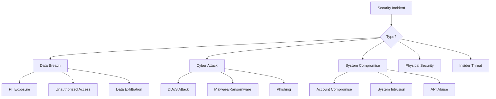
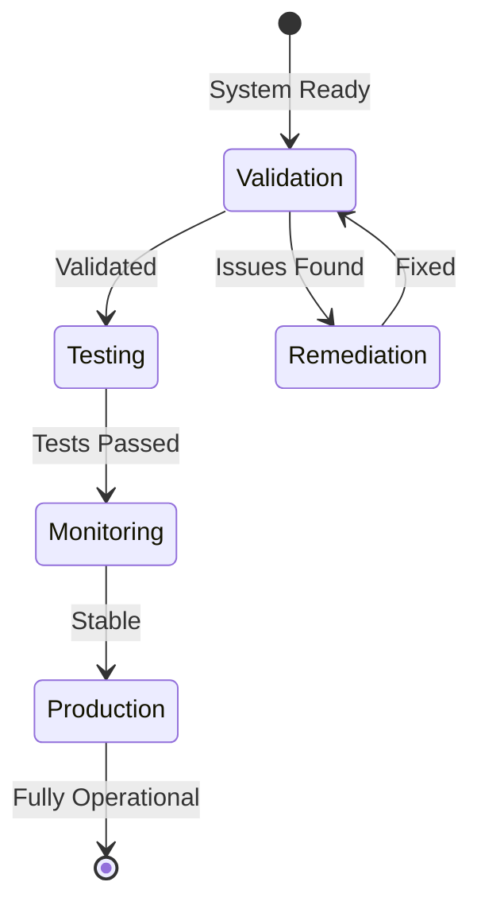
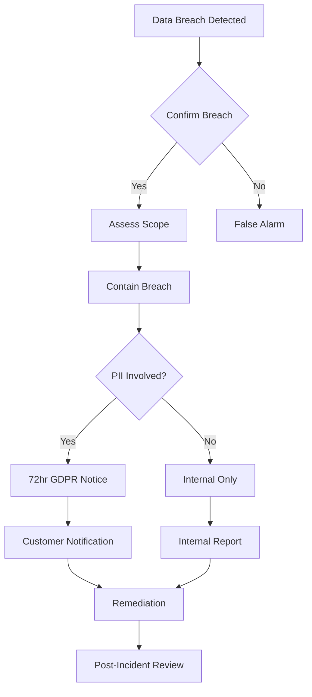
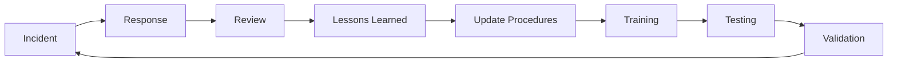
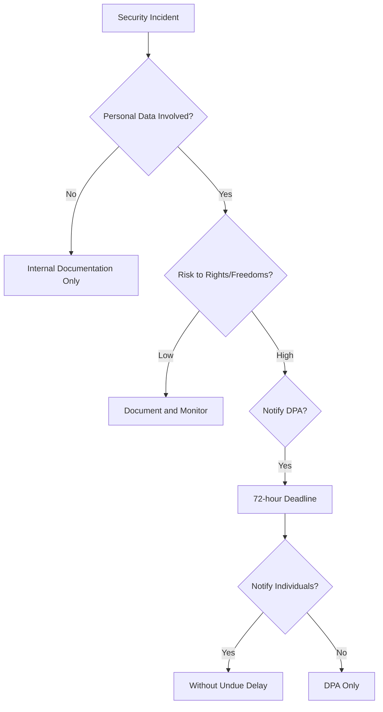

# APPENDIX E: INCIDENT RESPONSE PROCEDURES
## Maritime Onboarding System 2025
### Security Incident Management Framework

---

## EXECUTIVE SUMMARY

This document outlines the comprehensive incident response procedures for the Maritime Onboarding System, ensuring rapid detection, containment, and resolution of security incidents while maintaining compliance with GDPR Article 33/34 requirements and maritime industry standards.

**24/7 Incident Hotline:** [To be activated upon contract]  
**Incident Email:** incident@maritime-onboarding.eu  
**Maximum Response Time:** 15 minutes (Critical) / 2 hours (High)

---

## 1. INCIDENT RESPONSE FRAMEWORK

### 1.1 Incident Response Team (IRT)

| Role | Primary Responsibility | Contact | Backup |
|------|----------------------|---------|--------|
| **Incident Commander** | Overall incident coordination | DPO: M. Splinter | Security Lead |
| **Technical Lead** | Technical investigation & remediation | DevOps Lead | Senior Developer |
| **Security Analyst** | Threat analysis & forensics | Security Engineer | System Admin |
| **Communications Lead** | Stakeholder communication | PR Manager | DPO |
| **Legal Advisor** | Regulatory compliance | Legal Counsel | External Counsel |
| **Customer Liaison** | Customer notification | Account Manager | Support Lead |

### 1.2 Incident Classification

| Severity | Definition | Response Time | Escalation |
|----------|------------|---------------|------------|
| **P1 - Critical** | System-wide outage, data breach, ransomware | 15 minutes | Immediate |
| **P2 - High** | Partial outage, attempted breach, data exposure risk | 2 hours | Within 1 hour |
| **P3 - Medium** | Performance degradation, suspicious activity | 4 hours | Within 4 hours |
| **P4 - Low** | Minor issues, false positives | 8 hours | Next business day |

### 1.3 Incident Types



---

## 2. INCIDENT RESPONSE PHASES

### PHASE 1: PREPARATION (Continuous)

#### 1.1 Preventive Measures
- [ ] Security monitoring tools configured
- [ ] Incident response plan documented
- [ ] Team contact list updated
- [ ] Communication templates prepared
- [ ] Forensic tools ready
- [ ] Backup systems verified
- [ ] Legal requirements documented

#### 1.2 Detection Capabilities
| Detection Method | Tool/Process | Alert Mechanism |
|-----------------|--------------|-----------------|
| **Automated Monitoring** | SIEM/IDS | Email, SMS, Dashboard |
| **User Reports** | Support tickets | Ticketing system |
| **Threat Intelligence** | External feeds | Security dashboard |
| **Audit Logs** | Log analysis | Automated alerts |
| **Health Checks** | System monitoring | Status page |

### PHASE 2: DETECTION & ANALYSIS (T+0 to T+1 hour)

#### 2.1 Initial Detection
```
Time: T+0 minutes
Actions:
1. Alert received/incident detected
2. Initial assessment by on-call engineer
3. Severity classification
4. IRT activation if P1/P2
```

#### 2.2 Triage Checklist
- [ ] Verify the incident is real (not false positive)
- [ ] Determine incident type and scope
- [ ] Identify affected systems/data
- [ ] Assess business impact
- [ ] Document initial findings
- [ ] Activate appropriate response team

#### 2.3 Evidence Collection
| Evidence Type | Collection Method | Storage Location |
|--------------|------------------|------------------|
| **System Logs** | Automated export | Secure forensic storage |
| **Network Traffic** | Packet capture | Encrypted archive |
| **Memory Dumps** | Forensic tools | Isolated system |
| **User Activity** | Audit logs | Compliance database |
| **Screenshots** | Manual capture | Incident folder |

### PHASE 3: CONTAINMENT (T+1 to T+4 hours)

#### 3.1 Short-term Containment
```yaml
Immediate Actions:
  - Isolate affected systems
  - Disable compromised accounts
  - Block malicious IPs/domains
  - Preserve evidence
  - Prevent incident spread
  
Decision Matrix:
  Data_Breach:
    - Revoke affected access tokens
    - Reset compromised credentials
    - Enable additional monitoring
  
  Malware:
    - Disconnect infected systems
    - Quarantine malicious files
    - Update security rules
  
  DDoS:
    - Enable DDoS protection
    - Scale infrastructure
    - Implement rate limiting
```

#### 3.2 Long-term Containment
- Install patches/updates
- Improve security controls
- Implement additional monitoring
- Review and update firewall rules
- Enhance access controls

### PHASE 4: ERADICATION (T+4 to T+24 hours)

#### 4.1 Threat Removal
| Action | Responsibility | Verification |
|--------|---------------|--------------|
| Remove malware | Security Analyst | Antivirus scan clean |
| Delete backdoors | Technical Lead | Security audit passed |
| Close vulnerabilities | DevOps Team | Penetration test |
| Fix exploited bugs | Development Team | Code review complete |
| Update configurations | System Admin | Config audit |

#### 4.2 System Hardening
```bash
# Hardening Checklist
□ Update all system packages
□ Apply security patches
□ Review user permissions
□ Audit system configurations
□ Update security policies
□ Enhance monitoring rules
□ Review firewall rules
□ Update threat signatures
```

### PHASE 5: RECOVERY (T+24 to T+72 hours)

#### 5.1 System Restoration


#### 5.2 Recovery Checklist
- [ ] Restore systems from clean backups
- [ ] Rebuild compromised systems
- [ ] Reset all affected credentials
- [ ] Verify system integrity
- [ ] Test functionality
- [ ] Monitor for recurrence
- [ ] Confirm business operations

### PHASE 6: POST-INCIDENT (T+72 hours onwards)

#### 6.1 Lessons Learned Meeting
**Participants:** IRT, Management, Affected Teams  
**Timeline:** Within 5 business days  
**Agenda:**
1. Incident timeline review
2. What went well
3. What needs improvement
4. Action items
5. Process updates
6. Training needs

#### 6.2 Documentation Requirements
| Document | Purpose | Deadline |
|----------|---------|----------|
| **Incident Report** | Internal record | 48 hours |
| **Executive Summary** | Management briefing | 72 hours |
| **Technical Analysis** | Root cause & fixes | 5 days |
| **Regulatory Filing** | Compliance requirement | As required |
| **Customer Notice** | Transparency | As appropriate |
| **Improvement Plan** | Prevent recurrence | 10 days |

---

## 3. COMMUNICATION PROCEDURES

### 3.1 Internal Communication Matrix

| Incident Level | Who to Notify | When | Method |
|---------------|--------------|------|--------|
| **P1 - Critical** | CEO, CTO, DPO, Legal | Immediately | Phone call |
| **P2 - High** | CTO, DPO, Department Heads | Within 30 min | Phone/Email |
| **P3 - Medium** | Department Heads, Team Leads | Within 2 hours | Email/Slack |
| **P4 - Low** | Direct Manager | Within 4 hours | Email/Ticket |

### 3.2 External Communication Requirements

#### Customer Notification
```
Trigger: Personal data breach affecting customers
Timeline: Without undue delay, maximum 72 hours
Content:
- Nature of incident
- Data categories affected
- Potential consequences
- Mitigation measures taken
- Recommendations for customers
- Contact information for questions
```

#### Regulatory Notification (GDPR)
```
Authority: Dutch DPA (Autoriteit Persoonsgegevens)
Timeline: 72 hours from awareness
Method: Online form at autoriteitpersoonsgegevens.nl
Required Information:
- Nature of breach
- Categories and approximate number of data subjects
- Categories and approximate number of records
- Contact details of DPO
- Likely consequences
- Measures taken
```

### 3.3 Communication Templates

#### Initial Customer Notification
```
Subject: Important Security Update - Action Required

Dear [Customer Name],

We are writing to inform you of a security incident that may have affected your account.

What Happened:
[Brief description of incident]

Information Involved:
[Categories of data potentially affected]

What We Are Doing:
[Actions taken to address the incident]

What You Should Do:
[Recommended actions for customer]

For More Information:
Contact our security team at security@maritime-onboarding.eu
Reference: [Incident ID]

We sincerely apologize for any inconvenience.

[Signature]
```

---

## 4. SPECIFIC INCIDENT PLAYBOOKS

### 4.1 Data Breach Response



**Immediate Actions:**
1. Identify exposed data categories
2. Determine number of affected records
3. Assess risk to data subjects
4. Implement containment measures
5. Preserve forensic evidence
6. Begin notification timeline

### 4.2 Ransomware Response

**DO NOT PAY RANSOM - Company Policy**

**Immediate Actions:**
1. Isolate infected systems immediately
2. Disconnect network shares
3. Disable remote access
4. Identify ransomware variant
5. Check backup integrity
6. Contact law enforcement
7. Engage incident response firm

**Recovery Process:**
```
1. Wipe infected systems
2. Restore from clean backups
3. Apply all security updates
4. Reset all credentials
5. Implement additional monitoring
6. Conduct security awareness training
```

### 4.3 DDoS Attack Response

**Mitigation Steps:**
```yaml
Immediate:
  - Enable DDoS protection service
  - Increase rate limiting
  - Block attacking IPs
  - Scale infrastructure
  - Enable caching

Short-term:
  - Analyze attack patterns
  - Update WAF rules
  - Implement geo-blocking
  - Contact ISP for assistance

Long-term:
  - Review architecture
  - Implement CDN
  - Enhance monitoring
  - Create response automation
```

### 4.4 Account Compromise Response

**Containment Actions:**
1. Disable compromised account immediately
2. Reset password and MFA
3. Revoke all active sessions
4. Audit recent account activity
5. Check for privilege escalation
6. Review access logs
7. Scan for backdoors
8. Notify affected user

---

## 5. EVIDENCE HANDLING

### 5.1 Chain of Custody

| Step | Action | Documentation |
|------|--------|---------------|
| **Collection** | Secure evidence collection | Screenshot, hash, timestamp |
| **Storage** | Encrypted secure storage | Access log, location record |
| **Analysis** | Controlled examination | Analysis log, tool list |
| **Transfer** | Secure transfer protocol | Transfer log, recipient signature |
| **Retention** | Legal hold if required | Retention notice, duration |
| **Disposal** | Secure deletion | Destruction certificate |

### 5.2 Forensic Tools

| Tool | Purpose | Usage |
|------|---------|-------|
| **Log Aggregator** | Centralize logs | All incidents |
| **Network Analyzer** | Traffic analysis | Network incidents |
| **Memory Forensics** | RAM analysis | Malware incidents |
| **Disk Imaging** | Create forensic copies | System compromise |
| **Hash Tools** | Verify integrity | All evidence |

---

## 6. LEGAL AND COMPLIANCE

### 6.1 Regulatory Requirements

| Regulation | Notification Deadline | Authority | Penalties |
|------------|---------------------|-----------|-----------|
| **GDPR** | 72 hours | Dutch DPA | Up to 4% revenue |
| **NIS Directive** | Without undue delay | National CSIRT | Variable |
| **Maritime Cyber** | 24 hours | Flag State | License impact |
| **Insurance** | Per policy | Insurer | Coverage impact |

### 6.2 Documentation Requirements

**Incident Log Must Include:**
- Date and time of detection
- How incident was discovered
- Systems and data affected
- Actions taken with timestamps
- Personnel involved
- Communications sent
- Decisions made and rationale
- Evidence collected
- Costs incurred
- Lessons learned

---

## 7. TESTING AND MAINTENANCE

### 7.1 Testing Schedule

| Test Type | Frequency | Participants | Duration |
|-----------|-----------|--------------|----------|
| **Tabletop Exercise** | Quarterly | IRT + Management | 2 hours |
| **Technical Drill** | Monthly | Technical team | 1 hour |
| **Full Simulation** | Annually | All stakeholders | 4 hours |
| **Communication Test** | Monthly | IRT | 30 minutes |
| **Backup Recovery** | Quarterly | DevOps | 2 hours |

### 7.2 Continuous Improvement



---

## 8. QUICK REFERENCE CARDS

### 8.1 P1 Critical Incident - First 15 Minutes

```
□ 00:00 - Alert received
□ 00:02 - Verify incident
□ 00:05 - Classify as P1
□ 00:06 - Activate IRT
□ 00:08 - Begin containment
□ 00:10 - Start evidence collection
□ 00:12 - Executive notification
□ 00:15 - Initial assessment complete
```

### 8.2 Data Breach - First 72 Hours

```
□ Hour 1    - Confirm breach, assess scope
□ Hour 2    - Contain breach, preserve evidence
□ Hour 4    - Complete initial investigation
□ Hour 8    - Management briefing
□ Hour 24   - Determine notification requirements
□ Hour 48   - Prepare regulatory filing
□ Hour 72   - Submit GDPR notification
```

### 8.3 Key Contact Numbers

| Contact | Number | Available |
|---------|--------|-----------|
| **Security Hotline** | [TBD] | 24/7 |
| **DPO** | [TBD] | Business hours |
| **Legal Counsel** | [TBD] | 24/7 for P1 |
| **Dutch DPA** | +31 70 888 8500 | Business hours |
| **Cyber Insurance** | [TBD] | 24/7 |
| **Law Enforcement** | 112 / 0900-8844 | 24/7 |

---

## 9. APPENDICES

### Appendix A: Incident Report Form

```markdown
INCIDENT REPORT #: ___________
Date: ___________
Reporter: ___________

1. INCIDENT DETAILS
- Detection Time: ___________
- Type: [ ] Breach [ ] Attack [ ] Outage [ ] Other
- Severity: [ ] P1 [ ] P2 [ ] P3 [ ] P4
- Systems Affected: ___________

2. INITIAL RESPONSE
- First Responder: ___________
- Actions Taken: ___________
- Evidence Collected: ___________

3. IMPACT ASSESSMENT
- Data Affected: ___________
- Users Impacted: ___________
- Business Impact: ___________

4. RESOLUTION
- Root Cause: ___________
- Fix Applied: ___________
- Verified By: ___________

5. FOLLOW-UP
- Notifications Sent: ___________
- Improvements Needed: ___________
- Lessons Learned: ___________

Signature: ___________ Date: ___________
```

### Appendix B: Decision Tree - Notification Requirements



### Appendix C: Regulatory Contact Information

| Authority | Contact | Portal | Notes |
|-----------|---------|--------|-------|
| **Dutch DPA** | datalekken@autoriteitpersoonsgegevens.nl | mijn.autoriteitpersoonsgegevens.nl | 72-hour deadline |
| **EU CSIRT** | cert@cert.europa.eu | cert.europa.eu | Network incidents |
| **Maritime Authority** | [Flag State Specific] | Various | Cyber incidents |
| **Insurance** | [Policy Specific] | Per carrier | Check policy terms |

---

## 10. TRAINING MATERIALS

### 10.1 Role-Specific Training

| Role | Training Topics | Frequency |
|------|-----------------|-----------|
| **All Staff** | Security awareness, Incident reporting | Annual |
| **IRT Members** | Incident response procedures, Tools | Quarterly |
| **Technical Team** | Forensics, Containment techniques | Bi-annual |
| **Management** | Crisis management, Communication | Annual |
| **Customer Service** | Customer communication, Escalation | Quarterly |

### 10.2 Scenario Library

1. **Scenario: Customer Data Leak**
   - Trigger: Customer database exposed online
   - Complexity: Medium
   - Focus: GDPR compliance, customer notification

2. **Scenario: Ransomware Attack**
   - Trigger: Encryption of production systems
   - Complexity: High
   - Focus: Business continuity, recovery

3. **Scenario: Insider Threat**
   - Trigger: Malicious employee activity
   - Complexity: High
   - Focus: Detection, legal considerations

4. **Scenario: Supply Chain Compromise**
   - Trigger: Third-party service breach
   - Complexity: Medium
   - Focus: Vendor management, containment

---

## DOCUMENT CONTROL

| Version | Date | Author | Changes |
|---------|------|--------|---------|
| 1.0 | January 2025 | Security Team | Initial version |
| | | | |

**Next Review Date:** July 2025  
**Document Owner:** Data Protection Officer  
**Classification:** Confidential

---

*This Incident Response Procedure is a living document and should be updated based on lessons learned from actual incidents and exercises.*

*For questions or suggestions, contact: security@maritime-onboarding.eu*