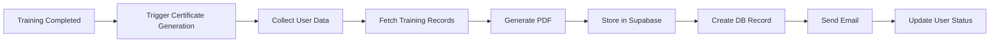

# Certificate System

The Maritime Onboarding Certificate System provides automated generation, distribution, and management of training completion certificates for crew members who have successfully completed their onboarding training.

## Overview

The certificate system is designed to:
- **Automatically generate** PDF certificates upon training completion
- **Distribute certificates** via email to crew members and HR
- **Store certificates** securely for compliance and auditing
- **Enable verification** through unique certificate numbers
- **Support multiple types** including standard and specialized certificates

## Certificate Types

### Standard Training Certificate
Generated automatically when a crew member completes all three training phases:
- Includes crew member details and position
- Shows training completion dates for each phase
- Displays quiz scores and overall performance
- Valid for 1 year from issue date
- Contains unique certificate number for verification

### Intro Kapitein Certificate
Specialized certificate for crew members in captain/leadership roles:
- Additional qualification details
- Extended validity period
- Specific regulatory compliance information
- Supervisor approval workflow
- Enhanced security features

## Certificate Generation Process

### Automatic Generation Flow


### Implementation Details
```javascript
// Automated certificate generation service
class AutomatedCertificateService {
  async generateCertificate(userId) {
    // 1. Fetch user data
    const user = await this.getUserData(userId);
    
    // 2. Verify training completion
    const trainingData = await this.getTrainingData(userId);
    if (!this.isTrainingComplete(trainingData)) {
      throw new Error('Training not complete');
    }
    
    // 3. Get quiz results
    const quizResults = await this.getQuizResults(userId);
    
    // 4. Prepare certificate data
    const certificateData = {
      user: {
        name: `${user.first_name} ${user.last_name}`,
        position: user.position,
        vessel: user.vessel_assignment,
        email: user.email
      },
      training: {
        phase1CompletedAt: trainingData.phase1.completed_at,
        phase2CompletedAt: trainingData.phase2.completed_at,
        phase3CompletedAt: trainingData.phase3.completed_at,
        overallScore: quizResults.averageScore
      },
      certificate: {
        number: this.generateCertificateNumber(userId),
        issueDate: new Date(),
        expiryDate: new Date(Date.now() + 365 * 24 * 60 * 60 * 1000),
        type: 'Maritime Onboarding Training'
      }
    };
    
    // 5. Generate PDF
    const pdfBuffer = await this.generatePDF(certificateData);
    
    // 6. Store certificate
    const filePath = await this.storeCertificate(userId, pdfBuffer);
    
    // 7. Create database record
    const certificate = await this.createCertificateRecord({
      user_id: userId,
      ...certificateData.certificate,
      file_path: filePath
    });
    
    // 8. Send email notification
    await this.sendCertificateEmail(user, certificate);
    
    return certificate;
  }
}
```

## PDF Generation

### Template Structure
The certificate PDF includes:
- Company logo and branding
- Certificate title and type
- Crew member information
- Training completion details
- Unique certificate number
- Issue and expiry dates
- QR code for verification
- Digital signatures

### PDF Generation Code
```javascript
import { PDFDocument, rgb, StandardFonts } from 'pdf-lib';
import QRCode from 'qrcode';

async function generateCertificatePDF(data) {
  // Create new PDF document
  const pdfDoc = await PDFDocument.create();
  const page = pdfDoc.addPage([595, 842]); // A4 size
  
  // Load fonts
  const timesRoman = await pdfDoc.embedFont(StandardFonts.TimesRoman);
  const helveticaBold = await pdfDoc.embedFont(StandardFonts.HelveticaBold);
  
  // Add header
  page.drawText('CERTIFICATE OF COMPLETION', {
    x: 150,
    y: 750,
    size: 24,
    font: helveticaBold,
    color: rgb(0, 0, 0.8)
  });
  
  // Add content
  const content = [
    'This is to certify that',
    '',
    data.user.name,
    data.user.position,
    '',
    'has successfully completed the',
    'Maritime Onboarding Training Program',
    '',
    `Certificate Number: ${data.certificate.number}`,
    `Issue Date: ${data.certificate.issueDate}`,
    `Expiry Date: ${data.certificate.expiryDate}`
  ];
  
  let yPosition = 650;
  content.forEach(line => {
    page.drawText(line, {
      x: 100,
      y: yPosition,
      size: line === data.user.name ? 18 : 14,
      font: line === data.user.name ? helveticaBold : timesRoman
    });
    yPosition -= 30;
  });
  
  // Add QR code for verification
  const qrCodeUrl = `${BASE_URL}/verify/${data.certificate.number}`;
  const qrCodeImage = await QRCode.toBuffer(qrCodeUrl);
  const qrImage = await pdfDoc.embedPng(qrCodeImage);
  
  page.drawImage(qrImage, {
    x: 450,
    y: 100,
    width: 100,
    height: 100
  });
  
  // Add signature line
  page.drawLine({
    start: { x: 100, y: 150 },
    end: { x: 300, y: 150 },
    thickness: 1
  });
  
  page.drawText('Authorized Signature', {
    x: 150,
    y: 130,
    size: 12,
    font: timesRoman
  });
  
  // Save PDF
  const pdfBytes = await pdfDoc.save();
  return Buffer.from(pdfBytes);
}
```

## Storage and Management

### Storage Structure
Certificates are stored in Supabase Storage with the following structure:
```
certificates/
└── {user_id}/
    └── {first_name}_{last_name}_Certificate_{timestamp}.pdf
```

### Database Schema
```sql
CREATE TABLE certificates (
  id UUID PRIMARY KEY DEFAULT gen_random_uuid(),
  user_id UUID REFERENCES users(id) ON DELETE CASCADE,
  certificate_type TEXT NOT NULL,
  certificate_number TEXT UNIQUE NOT NULL,
  issue_date DATE NOT NULL,
  expiry_date DATE,
  issuing_authority TEXT DEFAULT 'Maritime Training Department',
  file_path TEXT NOT NULL,
  verified BOOLEAN DEFAULT true,
  metadata JSONB,
  created_at TIMESTAMP WITH TIME ZONE DEFAULT NOW(),
  updated_at TIMESTAMP WITH TIME ZONE DEFAULT NOW()
);

-- Indexes for performance
CREATE INDEX idx_certificates_user ON certificates(user_id);
CREATE INDEX idx_certificates_number ON certificates(certificate_number);
CREATE INDEX idx_certificates_expiry ON certificates(expiry_date);
```

### Storage Security
- **Access Control**: RLS policies restrict access to authorized users
- **Encryption**: Files encrypted at rest in Supabase Storage
- **Backup**: Daily automated backups with 30-day retention
- **Audit Trail**: All certificate operations logged

## Email Distribution

### Distribution Workflow
1. Certificate generated and stored
2. Email sent to crew member with certificate attached
3. Copy sent to HR department for records
4. Optional copy to vessel captain or supervisor
5. Delivery confirmation tracked

### Email Template
```javascript
const certificateEmailTemplate = {
  subject: 'Your Maritime Training Certificate - {userName}',
  html: `
    <div style="font-family: Arial, sans-serif; max-width: 600px; margin: 0 auto;">
      <h1 style="color: #2563eb;">Congratulations!</h1>
      
      <p>Dear {userName},</p>
      
      <p>We are pleased to inform you that you have successfully completed 
      the Maritime Onboarding Training Program.</p>
      
      <div style="background: #f3f4f6; padding: 20px; margin: 20px 0; border-radius: 8px;">
        <h3>Certificate Details:</h3>
        <ul>
          <li><strong>Certificate Number:</strong> {certificateNumber}</li>
          <li><strong>Issue Date:</strong> {issueDate}</li>
          <li><strong>Expiry Date:</strong> {expiryDate}</li>
          <li><strong>Training Completed:</strong> {completionDate}</li>
        </ul>
      </div>
      
      <p>Your certificate is attached to this email. Please keep it for your records.</p>
      
      <p>You can also access your certificate anytime by logging into your 
      account at <a href="{dashboardUrl}">Maritime Training Portal</a>.</p>
      
      <div style="margin-top: 30px; padding-top: 20px; border-top: 1px solid #e5e7eb;">
        <p style="color: #6b7280; font-size: 12px;">
          This certificate can be verified at: {verificationUrl}
        </p>
      </div>
    </div>
  `,
  attachments: [
    {
      filename: 'Maritime_Training_Certificate.pdf',
      content: certificateBuffer
    }
  ]
};
```

## Manager Interface

### Certificate Management Dashboard
```jsx
// Manager's certificate management interface
function CertificateManagement() {
  const [certificates, setCertificates] = useState([]);
  const [filters, setFilters] = useState({});
  
  return (
    <div className="space-y-6">
      <CertificateFilters 
        onFilter={setFilters}
        options={{
          dateRange: true,
          certificateType: true,
          crewMember: true,
          status: true
        }}
      />
      
      <CertificateTable>
        <thead>
          <tr>
            <th>Certificate Number</th>
            <th>Crew Member</th>
            <th>Type</th>
            <th>Issue Date</th>
            <th>Expiry Date</th>
            <th>Status</th>
            <th>Actions</th>
          </tr>
        </thead>
        <tbody>
          {certificates.map(cert => (
            <CertificateRow 
              key={cert.id}
              certificate={cert}
              onView={viewCertificate}
              onRegenerate={regenerateCertificate}
              onDownload={downloadCertificate}
            />
          ))}
        </tbody>
      </CertificateTable>
      
      <CertificateSummary 
        total={certificates.length}
        expiringSoon={getExpiringSoon(certificates)}
        issuedThisMonth={getIssuedThisMonth(certificates)}
      />
    </div>
  );
}
```

### Certificate Actions
- **View**: Open certificate PDF in browser
- **Download**: Download certificate file
- **Regenerate**: Create new certificate with updated information
- **Send**: Email certificate to crew member
- **Verify**: Check certificate validity

## API Endpoints

### Certificate Management APIs

#### List Certificates
```javascript
GET /api/manager/certificates?page=1&limit=10&user_id=xxx

Response:
{
  certificates: [
    {
      id: "uuid",
      user_id: "uuid",
      certificate_type: "Maritime Onboarding Training",
      certificate_number: "BMS-456-1621234567890",
      issue_date: "2025-05-01",
      expiry_date: "2026-05-01",
      file_path: "456/John_Doe_Certificate_1621234567890.pdf",
      verified: true,
      user: {
        first_name: "John",
        last_name: "Doe",
        position: "Deck Officer",
        vessel_assignment: "MV Example"
      }
    }
  ],
  pagination: {
    page: 1,
    limit: 10,
    total: 42,
    pages: 5
  }
}
```

#### Regenerate Certificate
```javascript
POST /api/manager/certificates/regenerate

Request:
{
  userId: "uuid",
  certificateType: "standard",
  certificateId: "uuid" // Optional: ID of certificate to replace
}

Response:
{
  success: true,
  certificate: {
    id: "new-uuid",
    certificateNumber: "BMS-456-1621234599999",
    url: "https://storage.supabase.co/certificates/...",
    filename: "John_Doe_Certificate_1621234599999.pdf"
  }
}
```

#### Generate Intro Kapitein Certificate
```javascript
POST /api/pdf/generate-intro-kapitein

Request:
{
  targetUserId: "uuid"
}

Response:
{
  success: true,
  certificate: {
    id: "uuid",
    certificateNumber: "IK-456-1621234599999",
    type: "Intro Kapitein",
    url: "https://storage.supabase.co/certificates/..."
  }
}
```

## Certificate Verification

### Verification System
Each certificate includes a unique number and QR code for verification:

```javascript
// Verification endpoint
GET /api/public/verify-certificate/{certificateNumber}

Response:
{
  valid: true,
  certificate: {
    number: "BMS-456-1621234567890",
    holder: "John Doe",
    type: "Maritime Onboarding Training",
    issueDate: "2025-05-01",
    expiryDate: "2026-05-01",
    status: "active"
  }
}
```

### Verification Page
Public page where anyone can verify a certificate:
```jsx
function CertificateVerification() {
  const [certificateNumber, setCertificateNumber] = useState('');
  const [result, setResult] = useState(null);
  
  const verifyCertificate = async () => {
    const response = await fetch(`/api/public/verify-certificate/${certificateNumber}`);
    const data = await response.json();
    setResult(data);
  };
  
  return (
    <div className="max-w-2xl mx-auto p-6">
      <h1>Verify Certificate</h1>
      
      <div className="space-y-4">
        <input
          type="text"
          value={certificateNumber}
          onChange={(e) => setCertificateNumber(e.target.value)}
          placeholder="Enter certificate number"
          className="w-full p-2 border rounded"
        />
        
        <button 
          onClick={verifyCertificate}
          className="bg-blue-600 text-white px-4 py-2 rounded"
        >
          Verify
        </button>
      </div>
      
      {result && (
        <VerificationResult 
          valid={result.valid}
          certificate={result.certificate}
        />
      )}
    </div>
  );
}
```

## Compliance Features

### Audit Trail
All certificate operations are logged:
```javascript
// Log certificate generation
await logAuditEvent({
  userId: managerId,
  action: 'CERTIFICATE_GENERATED',
  resourceType: 'certificate',
  resourceId: certificate.id,
  details: {
    certificateNumber: certificate.certificate_number,
    crewMemberId: certificate.user_id,
    type: certificate.certificate_type
  }
});
```

### Retention Policy
- **Active Certificates**: Retained indefinitely
- **Expired Certificates**: Retained for 5 years after expiry
- **Replaced Certificates**: Marked as replaced, kept for audit
- **Deleted Records**: Soft delete only, data anonymized

### Compliance Reports
- Certificate issuance reports by date range
- Expiring certificates report
- Training completion statistics
- Audit trail exports

## Testing

### Test Scripts
The system includes comprehensive test scripts:

#### Certificate Generation Test
```bash
node scripts/test-certificate-generation.js [userId] [certificateType]
```

#### Email Distribution Test
```bash
node scripts/test-certificate-email.js [emailType] [testEmail]
```

#### API Integration Test
```bash
node scripts/test-certificate-api.js [authToken]
```

### Test Coverage
- PDF generation with various data scenarios
- Email delivery confirmation
- Storage and retrieval operations
- API endpoint functionality
- Error handling and edge cases

## Performance Optimization

### Caching Strategy
- Cache frequently accessed certificates
- Pre-generate common certificate elements
- Optimize PDF generation for speed

### Batch Operations
```javascript
// Batch certificate generation for multiple crew members
async function batchGenerateCertificates(userIds) {
  const results = await Promise.allSettled(
    userIds.map(userId => generateCertificate(userId))
  );
  
  return {
    successful: results.filter(r => r.status === 'fulfilled'),
    failed: results.filter(r => r.status === 'rejected')
  };
}
```

## Troubleshooting

### Common Issues

#### Certificate Generation Fails
- Check user has completed all training phases
- Verify quiz results exist and pass threshold
- Ensure PDF template is accessible
- Check storage permissions

#### Email Not Received
- Verify email address is correct
- Check MailerSend API key and configuration
- Review email logs for delivery status
- Check spam/junk folders

#### Storage Issues
- Verify Supabase Storage bucket exists
- Check storage quota hasn't been exceeded
- Ensure proper RLS policies on bucket
- Verify file upload size limits

### Debug Mode
```javascript
// Enable certificate debug logging
if (process.env.CERTIFICATE_DEBUG === 'true') {
  console.log('Certificate Debug:', {
    userData: user,
    trainingData: training,
    certificateData: certificate,
    pdfSize: pdfBuffer.length,
    emailStatus: emailResult
  });
}
```

## Best Practices

### For Administrators
1. Regularly review certificate expiry dates
2. Monitor certificate generation failures
3. Maintain certificate templates updated
4. Ensure email delivery is working
5. Backup certificate files regularly

### For Developers
1. Test certificate generation with various data
2. Handle edge cases gracefully
3. Implement proper error logging
4. Optimize PDF generation performance
5. Maintain backward compatibility

### Security Considerations
1. Validate all inputs before certificate generation
2. Ensure certificate numbers are cryptographically random
3. Implement access controls on certificate files
4. Log all certificate operations for audit
5. Regularly review and update security policies

## Related Documentation
- [Training System](./training-system.md) - Training completion triggers certificates
- [Email Service](../email-service-consolidation.md) - Email distribution system
- [PDF Templates](../api/README.md) - PDF generation details
- [Storage Architecture](../architecture/database.md) - File storage implementation