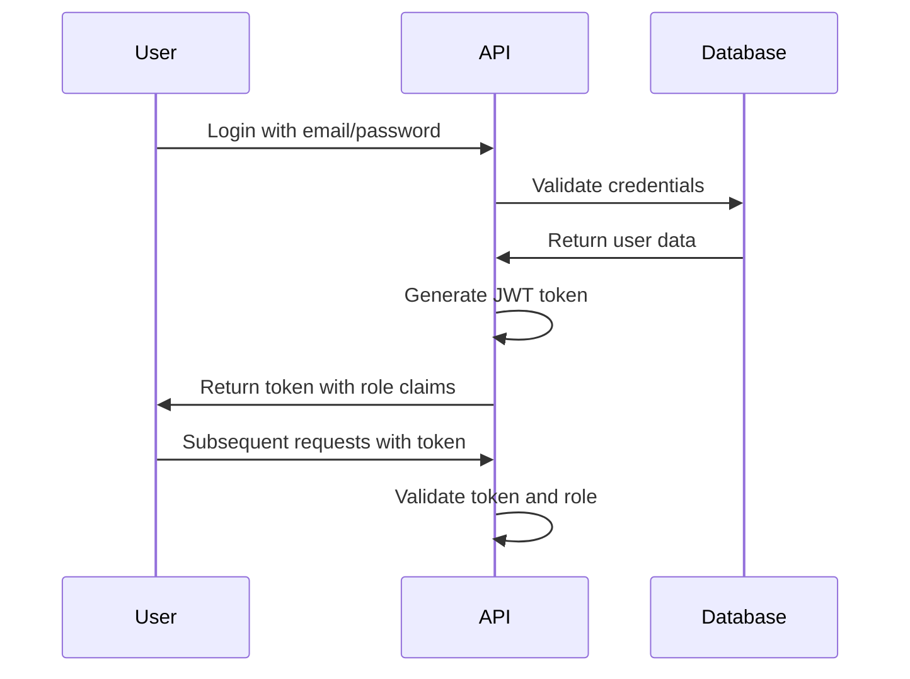
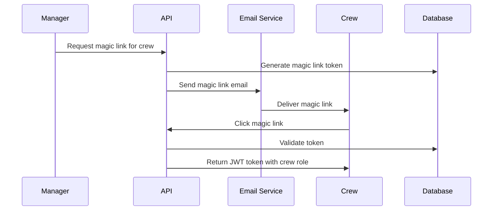

# Role-Based Access Control (RBAC) System

The Maritime Onboarding System implements a comprehensive three-tier role-based access control system to ensure proper security and workflow management across all system components.

## 🎯 **Role Hierarchy Overview**

The system uses a hierarchical role structure where higher-level roles inherit capabilities from lower levels, while maintaining strict access boundaries:

```
👑 Administrator (Admin)
    ↓ Full system control
👔 Manager
    ↓ Crew management and training oversight
👷 Crew Member
    ↓ Training completion and profile management
```

## 👑 **Administrator (Admin)**

### **Core Capabilities**
- **System Administration**: Complete control over all system settings and configuration
- **PDF Template Management**: Exclusive access to create, edit, and delete PDF certificate templates
- **Manager Account Management**: Create, activate/deactivate, and manage manager accounts
- **Audit Log Access**: View comprehensive system activity logs and user actions
- **System Analytics**: Access to detailed system statistics and performance metrics
- **Database Management**: Full access to all data and system maintenance functions

### **Access Areas**
- **Admin Dashboard** (`/admin`) - Central administration interface
- **PDF Template Editor** (`/templates/new`, `/templates/edit/:id`) - Certificate template creation
- **Manager Management Interface** - Manager account administration
- **System Settings** - Global system configuration
- **Audit Logs** - Security monitoring and compliance tracking
- **System Analytics** - Performance and usage statistics

### **Authentication Method**
- **Email and password authentication** with enhanced security requirements
- **Minimum 8-character passwords** with complexity requirements
- **Session logging** with comprehensive audit trail
- **Account lockout** after failed login attempts

### **Security Features**
- **Enhanced session management** with configurable timeouts
- **IP-based access restrictions** (configurable)
- **Two-factor authentication** (planned feature)
- **Privileged action confirmation** for critical operations

## 👔 **Manager**

### **Core Capabilities**
- **Crew Management**: Create, edit, and manage crew member accounts
- **Training Oversight**: Monitor and review training progress across all crew members
- **Quiz Review**: Review and approve/reject quiz results with detailed feedback
- **Certificate Management**: Generate, view, and manage crew certificates
- **Magic Link Distribution**: Send secure login links to crew members
- **Compliance Dashboard**: Monitor training compliance and generate reports

### **Access Areas**
- **Manager Dashboard** (`/manager`) - Central management interface
- **Crew Management Interface** - Crew account and profile management
- **Training Progress Monitoring** - Real-time training status tracking
- **Quiz Review System** - Quiz result evaluation and feedback
- **Certificate Management** - Certificate generation and distribution
- **Compliance Reporting** - Training compliance and audit reports

### **Restrictions**
- **No PDF Template Access**: Cannot create or modify certificate templates (admin-only)
- **No Manager Account Management**: Cannot create other manager accounts
- **No System Settings**: Cannot modify global system configuration
- **No Audit Log Access**: Cannot view system-wide audit logs

### **Authentication Method**
- **Email and password authentication** with standard security requirements
- **Account activation** required by administrator
- **Password reset** functionality available
- **Session management** with automatic timeout

## 👷 **Crew Member**

### **Core Capabilities**
- **Training Completion**: Access to all training phases and materials
- **Interactive Quiz Taking**: Complete quizzes and assessments for each phase
- **Profile Management**: Update personal information and preferences
- **Certificate Access**: View and download personal certificates
- **Progress Tracking**: Monitor own training progress and completion status
- **File Upload**: Upload training photos and proof of completion

### **Access Areas**
- **Crew Dashboard** (`/crew`) - Personal training interface
- **Training Modules** (`/crew/training/:phase`) - Phase-specific training content
- **Quiz Interface** (`/crew/quiz/:phase`) - Interactive quiz system
- **Personal Profile** (`/crew/profile`) - Profile management and preferences
- **Certificate Viewer** - Personal certificate access and download

### **Restrictions**
- **No Management Access**: Cannot manage other users or view their data
- **No Administrative Functions**: Cannot access system settings or configuration
- **No Template Access**: Cannot create or modify PDF templates
- **Data Isolation**: Can only access own training data and progress

### **Authentication Method**
- **Magic link authentication** - Secure, passwordless login system
- **Email-based tokens** generated and sent by managers
- **Time-limited access** with configurable expiration
- **Single-use tokens** for enhanced security

## 🔐 **Security Implementation**

### **Authentication Flow**

#### **Admin/Manager Authentication**


#### **Crew Magic Link Authentication**


### **Authorization Middleware**

The system implements comprehensive authorization checks at multiple levels:

#### **Route-Level Protection**
```javascript
// Example route protection
app.get('/admin/*', requireRole('admin'));
app.get('/manager/*', requireRole(['admin', 'manager']));
app.get('/crew/*', requireRole(['admin', 'manager', 'crew']));
```

#### **API Endpoint Security**
- **JWT token validation** on every request
- **Role verification** against endpoint requirements
- **Resource ownership validation** for data access
- **Rate limiting** based on user role

#### **Database Security**
- **Row Level Security (RLS)** policies on all tables
- **Role-based data access** restrictions
- **Audit logging** for all data modifications
- **Encrypted sensitive data** storage

### **Permission Matrix**

| Feature | Admin | Manager | Crew |
|---------|-------|---------|------|
| **System Settings** | ✅ Full | ❌ None | ❌ None |
| **PDF Templates** | ✅ Full | ❌ None | ❌ None |
| **Manager Accounts** | ✅ Full | ❌ None | ❌ None |
| **Crew Accounts** | ✅ View All | ✅ Manage | ❌ None |
| **Training Oversight** | ✅ View All | ✅ Manage | ❌ None |
| **Quiz Review** | ✅ View All | ✅ Review | ❌ None |
| **Certificates** | ✅ View All | ✅ Generate | ✅ View Own |
| **Training Completion** | ❌ None | ❌ None | ✅ Own Only |
| **Quiz Taking** | ❌ None | ❌ None | ✅ Own Only |
| **Profile Management** | ✅ All Users | ✅ Crew Only | ✅ Own Only |
| **Audit Logs** | ✅ Full | ❌ None | ❌ None |
| **File Uploads** | ✅ View All | ✅ View Crew | ✅ Own Only |

## 🛠️ **Implementation Details**

### **Database Schema**

#### **Users Table Structure**
```sql
CREATE TABLE users (
    id UUID PRIMARY KEY DEFAULT gen_random_uuid(),
    email VARCHAR(255) UNIQUE NOT NULL,
    first_name VARCHAR(100) NOT NULL,
    last_name VARCHAR(100) NOT NULL,
    role VARCHAR(20) NOT NULL CHECK (role IN ('admin', 'manager', 'crew')),
    is_active BOOLEAN DEFAULT true,
    password_hash VARCHAR(255), -- NULL for crew (magic link only)
    created_at TIMESTAMP DEFAULT NOW(),
    updated_at TIMESTAMP DEFAULT NOW()
);
```

#### **Row Level Security Policies**
```sql
-- Users can only see their own data unless they're admin/manager
CREATE POLICY "Users can view own data" ON users
    FOR SELECT USING (
        auth.uid() = id OR 
        auth.jwt() ->> 'role' IN ('admin', 'manager')
    );

-- Only admins can create manager accounts
CREATE POLICY "Admin can create managers" ON users
    FOR INSERT WITH CHECK (
        auth.jwt() ->> 'role' = 'admin' AND
        role IN ('admin', 'manager')
    );

-- Managers can create crew accounts
CREATE POLICY "Manager can create crew" ON users
    FOR INSERT WITH CHECK (
        auth.jwt() ->> 'role' IN ('admin', 'manager') AND
        role = 'crew'
    );
```

### **API Endpoint Protection**

#### **Authentication Middleware**
```javascript
const authenticateUser = async (req, res, next) => {
    try {
        const token = req.headers.authorization?.replace('Bearer ', '');
        if (!token) {
            return res.status(401).json({ error: 'Authentication required' });
        }
        
        const decoded = jwt.verify(token, process.env.JWT_SECRET);
        req.user = decoded;
        next();
    } catch (error) {
        return res.status(401).json({ error: 'Invalid token' });
    }
};
```

#### **Role-Based Authorization**
```javascript
const requireRole = (allowedRoles) => {
    return (req, res, next) => {
        if (!req.user) {
            return res.status(401).json({ error: 'Authentication required' });
        }
        
        const userRole = req.user.role;
        const roles = Array.isArray(allowedRoles) ? allowedRoles : [allowedRoles];
        
        if (!roles.includes(userRole)) {
            return res.status(403).json({ error: 'Insufficient permissions' });
        }
        
        next();
    };
};
```

## 🧪 **Testing and Verification**

### **Role Testing Scripts**
```bash
# Test admin access
npm run test:admin-access

# Test manager permissions
npm run test:manager-permissions

# Test crew restrictions
npm run test:crew-restrictions

# Test cross-role access
npm run test:role-boundaries
```

### **Security Verification**
```bash
# Verify RLS policies
npm run test:rls-policies

# Test authentication flows
npm run test:auth-flows

# Validate JWT tokens
npm run test:jwt-validation

# Check permission boundaries
npm run test:permission-boundaries
```

## 🚨 **Troubleshooting**

### **Common Issues**

#### **Authentication Failures**
```bash
# Check JWT secret configuration
echo $JWT_SECRET | wc -c  # Should be 128+ characters

# Verify user exists and is active
node -e "
const { getDatabase } = require('./config/database');
const db = getDatabase();
db.from('users').select('*').eq('email', 'user@example.com').then(console.log);
"
```

#### **Permission Denied Errors**
```bash
# Check user role assignment
node -e "
const { getDatabase } = require('./config/database');
const db = getDatabase();
db.from('users').select('email, role, is_active').then(console.log);
"

# Verify RLS policies
# Check Supabase dashboard → Authentication → Policies
```

#### **Magic Link Issues**
```bash
# Test magic link generation
node scripts/test-magic-link.js user@example.com

# Check email delivery
# Monitor MailerSend dashboard for delivery status
```

### **Security Auditing**
```bash
# Generate security audit report
npm run audit:security

# Check for privilege escalation vulnerabilities
npm run test:privilege-escalation

# Validate data access boundaries
npm run test:data-isolation
```

## 📚 **Related Documentation**

- **[Authentication System](authentication.md)** - Detailed authentication implementation
- **[Security Architecture](../architecture/security.md)** - Overall security design
- **[API Reference](../for-developers/api-reference/)** - API endpoints with role requirements
- **[Database Design](../for-developers/architecture/database-design.md)** - Database schema and RLS policies

## 🎯 **Best Practices**

1. **Principle of Least Privilege**: Users have only the minimum permissions needed
2. **Defense in Depth**: Multiple layers of security (API, database, application)
3. **Regular Auditing**: Continuous monitoring of access patterns and permissions
4. **Secure Defaults**: Restrictive permissions by default, explicit grants required
5. **Session Management**: Proper token expiration and refresh mechanisms
6. **Audit Logging**: Comprehensive logging of all privileged actions
