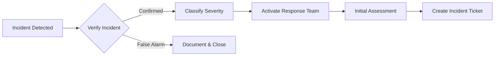

# Incident Response Procedures

## Overview

This document outlines the incident response procedures for the Maritime Onboarding System, including security incident handling, escalation procedures, and incident reporting templates.

## Table of Contents

1. [Incident Classification](#incident-classification)
2. [Incident Response Team](#incident-response-team)
3. [Incident Response Workflow](#incident-response-workflow)
4. [Security Incident Procedures](#security-incident-procedures)
5. [Operational Incident Procedures](#operational-incident-procedures)
6. [Communication Procedures](#communication-procedures)
7. [Post-Incident Procedures](#post-incident-procedures)
8. [Incident Report Templates](#incident-report-templates)

## Incident Classification

### Severity Levels

| Level | Name | Description | Response Time | Examples |
|-------|------|-------------|---------------|----------|
| P0 | Critical | Complete system outage or security breach | < 15 minutes | Data breach, ransomware, total outage |
| P1 | High | Major functionality impaired | < 1 hour | Login failures, database corruption |
| P2 | Medium | Significant feature unavailable | < 4 hours | Email service down, slow performance |
| P3 | Low | Minor feature issue | < 24 hours | UI bugs, non-critical errors |
| P4 | Informational | No immediate impact | < 1 week | Minor improvements needed |

### Incident Types

1. **Security Incidents**
   - Data breach
   - Unauthorized access
   - Malware/ransomware
   - DDoS attacks
   - Credential compromise

2. **Operational Incidents**
   - System outages
   - Performance degradation
   - Data corruption
   - Integration failures
   - Deployment issues

3. **Compliance Incidents**
   - GDPR violations
   - Data retention issues
   - Audit failures
   - Policy violations

## Incident Response Team

### Core Team Roles

| Role | Responsibilities | Contact |
|------|-----------------|---------|
| Incident Commander | Overall incident coordination | ic@burando.online |
| Security Lead | Security analysis and remediation | security@burando.online |
| Technical Lead | Technical investigation and fixes | tech@burando.online |
| Communications Lead | Internal/external communications | comms@burando.online |
| Legal Advisor | Legal and compliance guidance | legal@burando.online |

### Escalation Matrix

```
P0 (Critical) → Immediate: All team + Executive
     ↓
P1 (High) → 15 min: Core team + Management
     ↓
P2 (Medium) → 1 hour: Technical + Security leads
     ↓
P3 (Low) → 4 hours: On-call engineer
     ↓
P4 (Info) → Next business day: Regular team
```

## Incident Response Workflow

### Phase 1: Detection & Analysis (0-30 minutes)



**Actions:**
1. Verify the incident is real
2. Determine severity level
3. Activate appropriate response team
4. Create incident ticket
5. Begin initial investigation

**Checklist:**
- [ ] Incident verified
- [ ] Severity determined
- [ ] Team notified
- [ ] Ticket created (INC-YYYY-MM-DD-XXX)
- [ ] Initial timeline documented

### Phase 2: Containment (30 min - 2 hours)

**Immediate Containment:**
- [ ] Isolate affected systems
- [ ] Prevent further damage
- [ ] Preserve evidence
- [ ] Implement temporary fixes

**Short-term Containment:**
- [ ] Deploy patches
- [ ] Change credentials
- [ ] Block malicious IPs
- [ ] Enable additional monitoring

**Example Containment Actions:**
```bash
# Block suspicious IP
vercel env add BLOCKED_IPS="192.168.1.100,10.0.0.50" production

# Enable maintenance mode
vercel env add MAINTENANCE_MODE=true production

# Revoke compromised tokens
npm run security:revoke-tokens -- --user <user_id>
```

### Phase 3: Eradication (2-24 hours)

**Actions:**
- [ ] Remove malware/malicious code
- [ ] Patch vulnerabilities
- [ ] Update security measures
- [ ] Close attack vectors

**Verification:**
- [ ] Scan for remaining threats
- [ ] Verify patches applied
- [ ] Test security controls
- [ ] Review logs for completeness

### Phase 4: Recovery (1-7 days)

**Recovery Steps:**
1. Restore systems to production
2. Monitor for recurrence
3. Verify normal operations
4. Remove temporary measures

**Recovery Checklist:**
- [ ] Systems restored
- [ ] Monitoring enhanced
- [ ] Performance verified
- [ ] User access restored
- [ ] Communication sent

### Phase 5: Post-Incident (1-2 weeks)

**Activities:**
- [ ] Conduct post-mortem
- [ ] Update documentation
- [ ] Implement improvements
- [ ] Train team on lessons learned
- [ ] Update incident response procedures

## Security Incident Procedures

### Data Breach Response

**Immediate Actions (0-1 hour):**
1. Activate incident response team
2. Isolate affected systems
3. Preserve evidence
4. Assess scope of breach

**Investigation (1-4 hours):**
```bash
# Check access logs
vercel logs --prod --since 24h | grep "unauthorized"

# Review database activity
npm run db:audit-log -- --last 48h

# Check for data exfiltration
npm run security:check-exports
```

**Containment (2-8 hours):**
- Reset all potentially compromised credentials
- Revoke active sessions
- Implement additional access controls
- Enable enhanced logging

**Notification (within 72 hours):**
- [ ] Legal team informed
- [ ] Determine notification requirements
- [ ] Prepare breach notification
- [ ] Notify authorities (if required)
- [ ] Notify affected users

### DDoS Attack Response

**Detection:**
```bash
# Monitor traffic patterns
vercel logs --prod | grep -c "GET" | sort | uniq -c

# Check rate limiting
npm run monitor:rate-limits
```

**Mitigation:**
1. Enable DDoS protection
2. Implement rate limiting
3. Block malicious IPs
4. Scale infrastructure

**Recovery:**
- Gradually restore access
- Monitor for continued attacks
- Implement permanent protections

### Unauthorized Access

**Investigation Steps:**
1. Review authentication logs
2. Check for privilege escalation
3. Identify compromised accounts
4. Trace access patterns

**Response Actions:**
- Force password resets
- Implement MFA (if not enabled)
- Review and update permissions
- Audit all admin actions

## Operational Incident Procedures

### System Outage

**Diagnosis Flowchart:**
```
Is site accessible? 
    ├─ No → Check DNS, CDN, Network
    └─ Yes → Is API responding?
              ├─ No → Check Vercel, Functions
              └─ Yes → Is DB accessible?
                        ├─ No → Check Supabase
                        └─ Yes → Check specific service
```

**Recovery Priority:**
1. Authentication service
2. Database connectivity
3. Core API endpoints
4. Email service
5. File storage
6. Analytics

### Performance Degradation

**Quick Checks:**
```bash
# API response times
curl -w "@curl-format.txt" -o /dev/null -s https://api.example.com/health

# Database performance
npm run db:performance-check

# Function cold starts
vercel logs --prod | grep "Cold start"
```

**Optimization Steps:**
1. Scale serverless functions
2. Optimize database queries
3. Enable caching
4. Reduce payload sizes
5. Implement CDN

### Data Corruption

**Assessment:**
- Identify affected data
- Determine corruption extent
- Check backup availability
- Estimate recovery time

**Recovery Options:**
1. Restore from backup
2. Rebuild from audit logs
3. Manual data correction
4. Request user re-submission

## Communication Procedures

### Internal Communication

**Incident Channel Structure:**
```
#incident-YYYY-MM-DD-XXX
├── Status updates every 30 min
├── Technical findings
├── Action items
└── Decision log
```

**Update Template:**
```
🚨 INCIDENT UPDATE - [TIME]
Status: [Investigating|Contained|Recovering|Resolved]
Impact: [Description of impact]
Actions: [Current actions being taken]
Next Update: [Time]
```

### External Communication

**Customer Notification Triggers:**
- Service unavailable > 15 minutes
- Data breach affecting users
- Functionality degraded > 1 hour
- Scheduled maintenance

**Status Page Updates:**
```markdown
### [Incident Name]
**Status**: Investigating/Identified/Monitoring/Resolved
**Impact**: [Systems affected]
**Started**: [Time]

#### Updates:
- [Time]: [Update message]
- [Time]: [Update message]
```

### Stakeholder Communication

| Stakeholder | Severity | Method | Frequency |
|-------------|----------|--------|-----------|
| Executive Team | P0-P1 | Phone + Email | Every hour |
| Management | P0-P2 | Email + Slack | Every 2 hours |
| Customers | P0-P1 | Email + Status Page | As needed |
| Partners | P0-P2 | Email | Daily |

## Post-Incident Procedures

### Post-Mortem Process

**Timeline:**
- Schedule within 48 hours of resolution
- Complete within 1 week
- Share findings within 2 weeks

**Post-Mortem Template:**
```markdown
# Incident Post-Mortem: [INC-YYYY-MM-DD-XXX]

## Summary
- **Date**: [Date range]
- **Duration**: [Total time]
- **Impact**: [Users/systems affected]
- **Severity**: [P0-P4]

## Timeline
- [Time]: Detection
- [Time]: Response initiated
- [Time]: Root cause identified
- [Time]: Mitigation applied
- [Time]: Resolution confirmed

## Root Cause Analysis
### What Happened
[Detailed description]

### Why It Happened
[Root cause analysis using 5 Whys]

### Contributing Factors
- [Factor 1]
- [Factor 2]

## Impact Assessment
- **Users Affected**: [Number]
- **Data Loss**: [Yes/No, extent]
- **Financial Impact**: [Estimate]
- **Reputation Impact**: [Assessment]

## What Went Well
- [Success 1]
- [Success 2]

## What Could Be Improved
- [Improvement 1]
- [Improvement 2]

## Action Items
| Action | Owner | Due Date | Priority |
|--------|-------|----------|----------|
| [Action 1] | [Name] | [Date] | [High/Med/Low] |

## Lessons Learned
1. [Lesson 1]
2. [Lesson 2]
```

### Improvement Implementation

**Process:**
1. Review post-mortem action items
2. Prioritize improvements
3. Assign owners and deadlines
4. Track implementation
5. Verify effectiveness

**Categories:**
- Technical improvements
- Process updates
- Training needs
- Tool enhancements
- Documentation updates

## Incident Report Templates

### Initial Incident Report

```markdown
# Incident Report: [INC-YYYY-MM-DD-XXX]

**Report Date**: [Date/Time]
**Reporter**: [Name]
**Severity**: [P0-P4]
**Status**: Active

## Executive Summary
[1-2 sentence description of incident and impact]

## Incident Details
- **Start Time**: [Time]
- **Detection Method**: [How discovered]
- **Systems Affected**: [List]
- **Users Impacted**: [Number/Groups]

## Current Status
[Current investigation/mitigation status]

## Next Steps
1. [Action 1]
2. [Action 2]

## Resources Engaged
- [Team/Person 1]
- [Team/Person 2]
```

### Final Incident Report

```markdown
# Final Incident Report: [INC-YYYY-MM-DD-XXX]

**Report Date**: [Date/Time]
**Incident Duration**: [Start] - [End]
**Total Time**: [Duration]
**Severity**: [P0-P4]
**Status**: Closed

## Executive Summary
[Comprehensive summary of incident, impact, and resolution]

## Incident Timeline
[Detailed timeline of events]

## Root Cause
[Detailed root cause analysis]

## Resolution
[How the incident was resolved]

## Impact Analysis
- **Service Downtime**: [Duration]
- **Users Affected**: [Number]
- **Data Impact**: [Description]
- **Financial Impact**: [Estimate]

## Preventive Measures
[List of measures implemented to prevent recurrence]

## Recommendations
[Additional recommendations for improvement]

## Appendices
- A: Technical Details
- B: Communication Log
- C: Evidence/Screenshots
```

### Security Incident Report

```markdown
# Security Incident Report: [SEC-YYYY-MM-DD-XXX]

**Classification**: [Confidential/Internal Use]
**Report Date**: [Date/Time]
**Incident Type**: [Breach/Attack/Unauthorized Access]

## Incident Overview
- **Attack Vector**: [How the incident occurred]
- **Systems Compromised**: [List]
- **Data Affected**: [Types and volume]
- **Threat Actor**: [If known]

## Forensic Findings
[Technical analysis of the incident]

## Containment Measures
[Steps taken to contain the incident]

## Eradication Steps
[How the threat was removed]

## Legal/Compliance Impact
- **Regulations Affected**: [GDPR, etc.]
- **Notification Required**: [Yes/No]
- **Authorities Notified**: [List]

## Recommendations
### Immediate
1. [Action 1]

### Short-term (30 days)
1. [Action 1]

### Long-term (90 days)
1. [Action 1]
```

## Incident Response Tools

### Monitoring Commands

```bash
# System health
curl https://onboarding.burando.online/api/health

# Recent errors
vercel logs --prod --since 1h | grep ERROR

# Database status
npm run db:status

# Active connections
npm run monitor:connections

# Performance metrics
npm run monitor:performance
```

### Emergency Scripts

```bash
# Enable maintenance mode
./scripts/enable-maintenance.sh

# Block IP addresses
./scripts/block-ips.sh 192.168.1.100,10.0.0.50

# Revoke all tokens
./scripts/emergency-token-revoke.sh

# Database read-only mode
./scripts/enable-readonly-db.sh

# Full system backup
./scripts/emergency-backup.sh
```

## Training and Drills

### Monthly Drills

- **Tabletop Exercises**: Review scenarios
- **Technical Drills**: Practice procedures
- **Communication Tests**: Verify contact info

### Scenarios to Practice

1. Data breach discovery
2. DDoS attack response
3. System outage recovery
4. Ransomware containment
5. Insider threat handling

---

**Last Updated**: January 2, 2025  
**Next Review**: February 2, 2025  
**Document Owner**: Security Team  
**Emergency Contact**: +31 (0) 20 123 4567