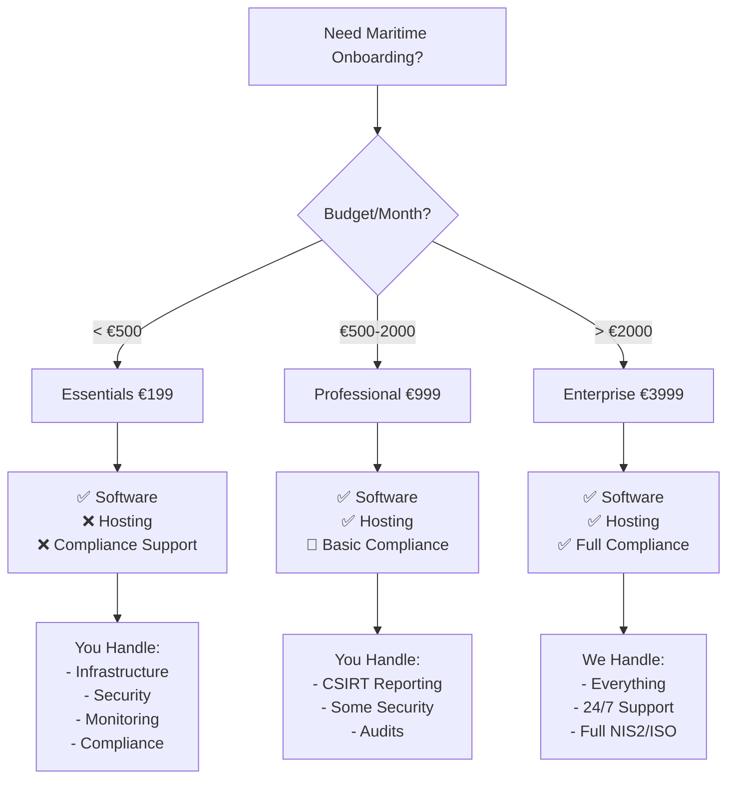

# Visual Compliance Summary - Maritime Onboarding System

## Quick Decision Tree



## Compliance Coverage Visualization

```
         ESSENTIALS    PROFESSIONAL    ENTERPRISE
         €199/month    €999/month      €3999/month
         
NIS2:    ████░░░░░░    ███████░░░      ██████████  
ISO:     █████░░░░░    ████████░░      ██████████
GDPR:    ████████░░    ██████████      ██████████
Audit:   ██████░░░░    ████████░░      ██████████

Legend:  █ = Included/Supported  ░ = Customer Responsibility
```

## Cost Breakdown Per Crew Member

| Crew/Month | Essentials | Professional | Enterprise |
|------------|------------|--------------|------------|
| 10 crew    | **€19.90/crew** | €99.90/crew | €399.90/crew |
| 50 crew    | **€3.98/crew** | **€19.98/crew** | €79.98/crew |
| 100 crew   | €1.99/crew | **€9.99/crew** | €39.99/crew |
| 500 crew   | €0.40/crew | €2.00/crew | **€8.00/crew** |

**Bold** = Recommended tier for this volume

## Feature Comparison Matrix

```
Feature                     ESS  PRO  ENT
─────────────────────────────────────────
Core Onboarding            ✅   ✅   ✅
Multi-language             ✅   ✅   ✅
Certificate Generation     ✅   ✅   ✅
Basic Reporting           ✅   ✅   ✅
─────────────────────────────────────────
Cloud Hosting              ❌   ✅   ✅
Automatic Backups          ❌   ✅   ✅
99.9% Uptime SLA          ❌   ❌   ✅
Zero Downtime Updates      ❌   ❌   ✅
─────────────────────────────────────────
Email Support (48h)        ✅   ❌   ❌
Priority Support (24h)     ❌   ✅   ❌
Dedicated Support (4h)     ❌   ❌   ✅
24/7 Phone Support        ❌   ❌   ✅
─────────────────────────────────────────
Security Monitoring        ❌   🤝   ✅
Penetration Testing       ❌   💰   ✅
ISO 27001 Support         ❌   🤝   ✅
CSIRT Integration         ❌   ❌   ✅
─────────────────────────────────────────

Legend:
✅ = Included
🤝 = Shared/Partial
💰 = Paid Add-on
❌ = Not Available
```

## Who Handles What? - Visual Summary

### 🟦 Essentials (€199)
```
     VENDOR (Us)          CUSTOMER (You)
    ┌─────────┐          ┌──────────────┐
    │Software │          │Infrastructure│
    │Updates  │          │Security      │
    │License  │          │Monitoring    │
    └─────────┘          │Backups       │
         5%              │Compliance    │
                         │Support       │
                         └──────────────┘
                              95%
```

### 🟩 Professional (€999)
```
     VENDOR (Us)          CUSTOMER (You)
    ┌─────────────┐      ┌──────────┐
    │Software     │      │CSIRT     │
    │Hosting      │      │Audits    │
    │Backups      │      │Policies  │
    │Monitoring   │      └──────────┘
    │Basic Support│           30%
    └─────────────┘
         70%
```

### 🟪 Enterprise (€3999)
```
     VENDOR (Us)          CUSTOMER (You)
    ┌──────────────┐     ┌──────────┐
    │Everything    │     │Use the   │
    │24/7 Support  │     │system    │
    │Full Compliance│    └──────────┘
    │Monitoring    │          5%
    │Incident Mgmt │
    └──────────────┘
         95%
```

## ROI Calculator

### Small Rederij (20 crew/month)
```
Current Process (Manual):
- Admin time: 2h/crew × 20 = 40h/month
- Cost: 40h × €35 = €1,400/month

With Essentials (€199):
- Admin time: 0.5h/crew × 20 = 10h/month  
- Cost: 10h × €35 + €199 = €549/month
- SAVINGS: €851/month (61% reduction)
```

### Medium Rederij (100 crew/month)
```
Current Process (Manual):
- Admin time: 2h/crew × 100 = 200h/month
- Cost: 200h × €35 = €7,000/month

With Professional (€999):
- Admin time: 0.25h/crew × 100 = 25h/month
- Cost: 25h × €35 + €999 = €1,874/month
- SAVINGS: €5,126/month (73% reduction)
```

## Compliance Readiness Indicator

```
If you answer YES to any of these, you need PROFESSIONAL or higher:
□ Do you process >50 crew per month?
□ Are you subject to port state audits?
□ Do you need 24/7 system availability?
□ Is data hosting location critical?

If you answer YES to any of these, you need ENTERPRISE:
□ Are you a NIS2 essential entity?
□ Do you require ISO 27001 certification support?
□ Do you need 24/7 incident response?
□ Must you report to CSIRT within 24 hours?
```

## Migration Path Visualization

```
    ESSENTIALS           PROFESSIONAL          ENTERPRISE
        │                     │                     │
        ├────Upgrade────────>│                     │
        │   (1 week)         │                     │
        │                    ├────Upgrade────────>│
        │                    │    (1 week)        │
        ├────────────Upgrade─────────────────────>│
        │           (2 weeks)                     │
        │                                          │
   €199/month            €999/month           €3,999/month
```

## The Bottom Line

| Choose This | If Your Priority Is | You'll Get | You Won't Get |
|------------|-------------------|------------|---------------|
| **Essentials** | 💰 Lowest cost | Working software | Any operational support |
| **Professional** | ⚖️ Balance | Managed hosting + basic support | Full compliance coverage |
| **Enterprise** | ✅ Full compliance | Everything managed for you | Low monthly bills |

## Contact Sales

Ready to choose? Questions about which tier fits?

📧 sales@maritime-onboarding.com  
📞 +31 (0)20 123 4567  
💬 Live chat at onboarding.burando.online

---

*Prices valid through 2025. Volume discounts available for >500 crew/month.*