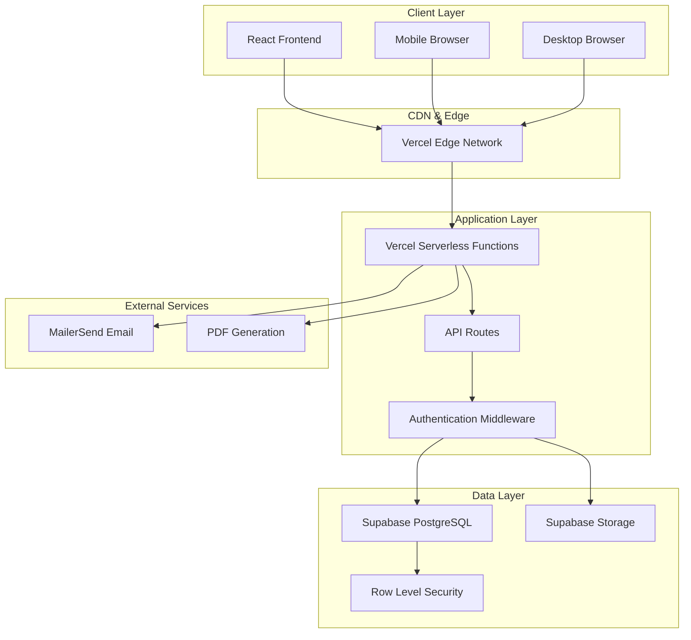
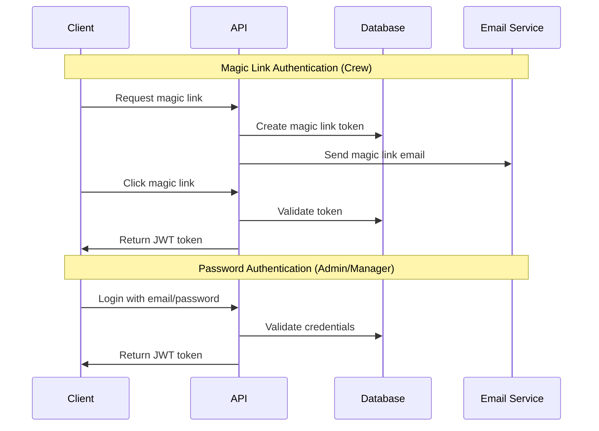
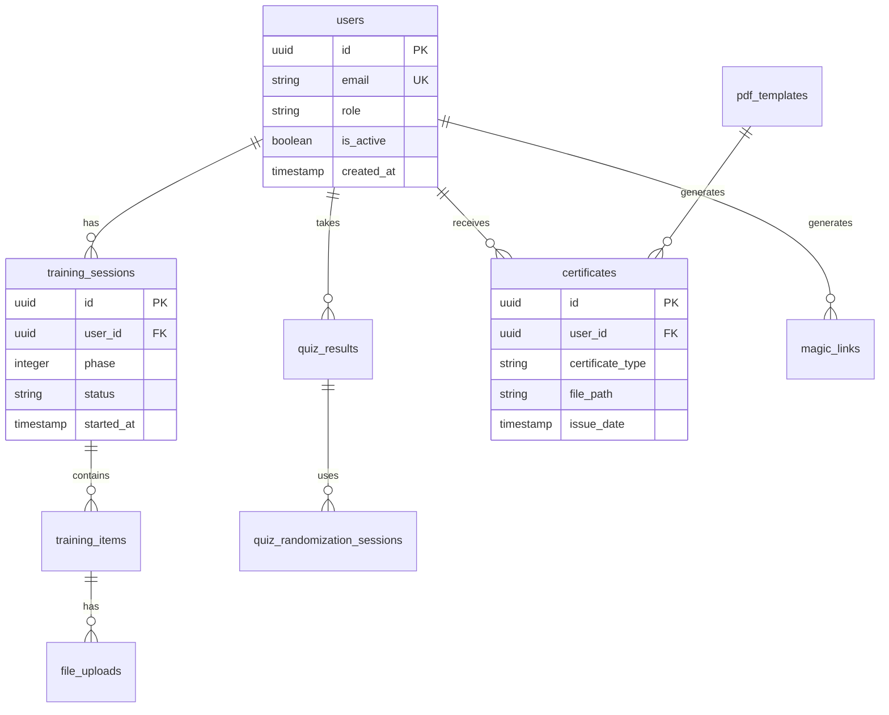
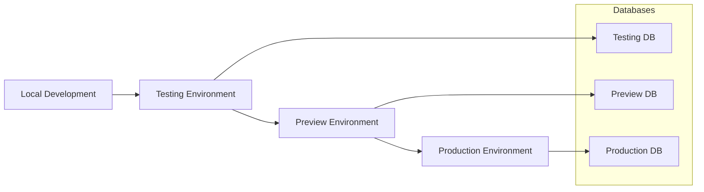

# System Architecture

This document provides a comprehensive overview of the Maritime Onboarding System architecture, including system design, technology choices, and architectural patterns.

## 🏗️ **High-Level Architecture**

The Maritime Onboarding System follows a modern, cloud-native architecture designed for scalability, reliability, and maintainability.



## 🎯 **Architecture Principles**

### **1. Unified Architecture**
- **Single Codebase**: Same code runs in all environments
- **Serverless Functions**: Consistent API layer across environments
- **No Dual Systems**: Eliminated Express.js/Vercel confusion

### **2. Cloud-Native Design**
- **Serverless Computing**: Auto-scaling Vercel functions
- **Managed Database**: Supabase PostgreSQL with automatic backups
- **CDN Distribution**: Global edge network for performance

### **3. Security-First**
- **Row Level Security**: Database-level access control
- **JWT Authentication**: Stateless, secure token-based auth
- **Role-Based Access**: Granular permission system

### **4. Developer Experience**
- **API-First**: Well-documented RESTful API
- **Type Safety**: Consistent data models
- **Hot Reload**: Fast development iteration

## 🔧 **Technology Stack**

### **Frontend Technologies**
| Component | Technology | Purpose |
|-----------|------------|---------|
| **Framework** | React 18 | Modern UI framework with hooks |
| **Routing** | React Router v6 | Client-side routing |
| **Styling** | TailwindCSS | Utility-first CSS framework |
| **State Management** | React Context | Global state (Auth, Language) |
| **HTTP Client** | Axios | API communication |
| **Internationalization** | i18next | Multi-language support (EN/NL) |
| **PDF Viewing** | PDF.js | Client-side PDF rendering |

### **Backend Technologies**
| Component | Technology | Purpose |
|-----------|------------|---------|
| **Runtime** | Node.js 18+ | JavaScript runtime |
| **Functions** | Vercel Serverless | Auto-scaling API endpoints |
| **Database** | Supabase PostgreSQL | Primary data storage |
| **Storage** | Supabase Storage | File and document storage |
| **Authentication** | JWT + Custom | Token-based authentication |
| **Email** | MailerSend | Transactional email delivery |
| **PDF Generation** | PDFKit | Server-side PDF creation |
| **Cron Jobs** | Vercel Cron | Scheduled task execution |

### **Development & Deployment**
| Component | Technology | Purpose |
|-----------|------------|---------|
| **Version Control** | Git + GitHub | Source code management |
| **CI/CD** | Vercel | Automated deployment pipeline |
| **Environment Management** | Vercel Environments | Multi-stage deployment |
| **Database Migrations** | Supabase CLI | Schema version control |
| **Monitoring** | Vercel Analytics | Performance monitoring |

## 🌐 **System Components**

### **1. Frontend Application (React)**

#### **Component Architecture**
```
client/src/
├── components/          # Reusable UI components
│   ├── common/         # Shared components
│   ├── admin/          # Admin-specific components
│   ├── manager/        # Manager-specific components
│   └── crew/           # Crew-specific components
├── pages/              # Page-level components
├── contexts/           # React contexts
├── services/           # API service functions
├── utils/              # Utility functions
└── assets/             # Static assets
```

#### **State Management**
- **AuthContext**: User authentication and role management
- **LanguageContext**: Internationalization and language switching
- **Local State**: Component-specific state with useState/useReducer

#### **Routing Strategy**
- **Role-Based Routes**: Different routes for admin/manager/crew
- **Protected Routes**: Authentication required for all app routes
- **Dynamic Redirects**: Automatic redirection based on user role

### **2. API Layer (Vercel Functions)**

#### **API Structure**
```
api/
├── auth/               # Authentication endpoints
├── admin/              # Admin-only endpoints
├── manager/            # Manager-only endpoints
├── crew/               # Crew-only endpoints
├── training/           # Training system endpoints
├── upload/             # File upload endpoints
├── pdf/                # PDF generation endpoints
├── cron/               # Scheduled task endpoints
└── health.js           # Health check endpoint
```

#### **Middleware Stack**
1. **CORS Handling**: Cross-origin request support
2. **Authentication**: JWT token validation
3. **Authorization**: Role-based access control
4. **Rate Limiting**: API abuse prevention
5. **Error Handling**: Consistent error responses
6. **Logging**: Request/response logging

### **3. Database Layer (Supabase)**

#### **Database Features**
- **PostgreSQL 15**: Modern relational database
- **Row Level Security**: Database-level access control
- **Real-time Subscriptions**: Live data updates
- **Automatic Backups**: Point-in-time recovery
- **Connection Pooling**: Efficient connection management

#### **Storage Features**
- **File Storage**: Secure file upload/download
- **Bucket Policies**: Fine-grained access control
- **CDN Integration**: Fast file delivery
- **Image Optimization**: Automatic image processing

## 🔐 **Security Architecture**

### **Authentication Flow**


### **Authorization Model**
- **Role Hierarchy**: Admin > Manager > Crew
- **Resource-Based Access**: Users can only access their own data
- **Action-Based Permissions**: Different actions require different roles
- **Database-Level Security**: RLS policies enforce access control

### **Data Protection**
- **Encryption at Rest**: Database and storage encryption
- **Encryption in Transit**: HTTPS/TLS for all communications
- **Secure Headers**: CSP, HSTS, and other security headers
- **Input Validation**: Server-side validation for all inputs

## 📊 **Data Architecture**

### **Database Schema Overview**


### **Data Flow Patterns**
1. **User Registration**: Manager creates crew → Magic link sent → Crew activates
2. **Training Progression**: Phase 1 → Phase 2 → Phase 3 → Certificate
3. **File Upload**: Client → API → Supabase Storage → Database reference
4. **Email Notifications**: Trigger → Template → MailerSend → Delivery

## 🚀 **Deployment Architecture**

### **Multi-Environment Strategy**


### **Environment Isolation**
- **Separate Databases**: Each environment has its own Supabase project
- **Environment Variables**: Different configurations per environment
- **Branch-Based Deployment**: Git branches trigger deployments
- **Automated Migrations**: Database schema updates on deployment

### **Scalability Features**
- **Serverless Auto-Scaling**: Functions scale based on demand
- **Database Connection Pooling**: Efficient database connections
- **CDN Caching**: Static assets cached globally
- **Edge Computing**: Functions run close to users

## 📈 **Performance Architecture**

### **Frontend Optimization**
- **Code Splitting**: Lazy loading of components
- **Bundle Optimization**: Tree shaking and minification
- **Image Optimization**: Responsive images and formats
- **Caching Strategy**: Browser and CDN caching

### **Backend Optimization**
- **Database Indexing**: Optimized query performance
- **Connection Pooling**: Efficient database connections
- **Caching**: API response caching where appropriate
- **Async Processing**: Non-blocking operations

### **Monitoring & Observability**
- **Performance Metrics**: Response times and throughput
- **Error Tracking**: Comprehensive error logging
- **Health Checks**: System health monitoring
- **User Analytics**: Usage patterns and performance

## 🔄 **Integration Architecture**

### **External Service Integration**
- **MailerSend**: Email delivery service
- **Supabase**: Database and storage provider
- **Vercel**: Hosting and deployment platform
- **PDF Generation**: Server-side PDF creation

### **API Design Patterns**
- **RESTful APIs**: Standard HTTP methods and status codes
- **Consistent Response Format**: Standardized API responses
- **Error Handling**: Comprehensive error codes and messages
- **Rate Limiting**: API abuse prevention

## 📚 **Architecture Documentation**

### **Detailed Component Guides**
- **[Database Design](architecture/database.md)** - Comprehensive database schema and design
- **[API Architecture](architecture/api.md)** - API design patterns and conventions
- **[Frontend Architecture](architecture/frontend.md)** - React application structure
- **[Security Implementation](architecture/security.md)** - Security measures and best practices

### **Related Documentation**
- **[Development Guide](../development/README.md)** - Development environment and workflow
- **[Deployment Guide](../for-administrators/deployment/overview.md)** - Deployment procedures and environments
- **[API Reference](../for-developers/api-reference/)** - Complete API documentation
- **[Feature Documentation](../features/README.md)** - System features and capabilities

## 🎯 **Architecture Benefits**

### **Scalability**
- **Auto-scaling serverless functions**
- **Managed database with automatic scaling**
- **Global CDN distribution**
- **Efficient resource utilization**

### **Reliability**
- **Multi-region deployment**
- **Automatic failover and recovery**
- **Comprehensive monitoring and alerting**
- **Regular automated backups**

### **Maintainability**
- **Clear separation of concerns**
- **Consistent coding patterns**
- **Comprehensive documentation**
- **Automated testing and deployment**

### **Security**
- **Defense in depth strategy**
- **Regular security updates**
- **Compliance with best practices**
- **Comprehensive audit logging**

This architecture provides a solid foundation for the Maritime Onboarding System, ensuring it can scale to meet growing demands while maintaining security, performance, and reliability.
