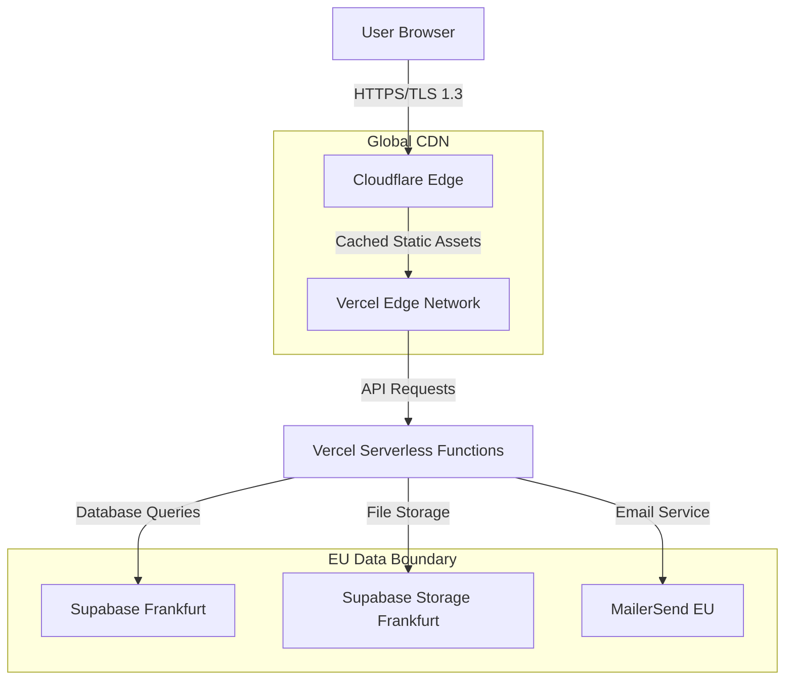

# Infrastructure Documentation
## Maritime Onboarding System - NIS2 Compliance

**Document Version:** 1.0  
**Last Updated:** January 2025  
**Classification:** Internal Use Only  
**Owner:** Security Team  

---

## Executive Summary

This document provides comprehensive infrastructure documentation for NIS2 compliance, addressing the hosting and data localization discrepancies identified in the audit.

**Key Facts:**
- **Primary Hosting:** Vercel Edge Network (Global CDN)
- **Database:** Supabase PostgreSQL (AWS Frankfurt, eu-central-1)
- **Data Location:** European Union (Germany)
- **CDN Provider:** Cloudflare (via Vercel)
- **Compliance Status:** EU GDPR Compliant

---

## 1. HOSTING ARCHITECTURE

### 1.1 Application Hosting
```
Frontend Application (React)
├── Hosting Provider: Vercel Inc.
├── Infrastructure: Vercel Edge Network
├── CDN: Cloudflare (integrated)
├── Regions: Global edge locations
├── Primary Region: Frankfurt (fra1)
└── Compliance: SOC 2 Type II, GDPR
```

### 1.2 Database Hosting
```
Database (PostgreSQL)
├── Provider: Supabase Inc.
├── Infrastructure: AWS Frankfurt
├── Region: eu-central-1 (Frankfurt, Germany)
├── Backup Region: eu-west-1 (Ireland)
├── Encryption: AES-256-GCM at rest
└── Compliance: SOC 2 Type II, GDPR, ISO 27001
```

### 1.3 Data Flow Architecture


---

## 2. DATA LOCALIZATION COMPLIANCE

### 2.1 Data Residency
| Data Type | Location | Provider | Compliance |
|-----------|----------|----------|------------|
| **User Data** | Frankfurt, DE | Supabase | GDPR Art. 44-49 |
| **Application Data** | Frankfurt, DE | Supabase | GDPR Art. 44-49 |
| **File Storage** | Frankfurt, DE | Supabase | GDPR Art. 44-49 |
| **Audit Logs** | Frankfurt, DE | Supabase | GDPR Art. 44-49 |
| **Static Assets** | Global CDN | Cloudflare | No personal data |

### 2.2 Cross-Border Data Transfers
- **No personal data** transferred outside EU
- **Static assets** (CSS, JS, images) served globally via CDN
- **API requests** processed in EU region only
- **Database connections** remain within eu-central-1

### 2.3 Legal Basis
- **GDPR Article 6(1)(b):** Processing necessary for contract performance
- **GDPR Article 6(1)(f):** Legitimate interests for security monitoring
- **Standard Contractual Clauses** with all sub-processors

---

## 3. VENDOR CHAIN MAPPING

### 3.1 Primary Vendors
```
Maritime Onboarding System
├── Vercel Inc. (US company, EU infrastructure)
│   ├── Service: Application hosting
│   ├── Data Processing: Static assets only
│   ├── Location: Global edge, EU processing
│   └── Compliance: SOC 2, GDPR DPA signed
├── Supabase Inc. (US company, EU infrastructure)
│   ├── Service: Database & storage
│   ├── Data Processing: All personal data
│   ├── Location: Frankfurt, Germany
│   └── Compliance: SOC 2, GDPR DPA signed
└── MailerSend (EU company)
    ├── Service: Transactional emails
    ├── Data Processing: Email addresses only
    ├── Location: European Union
    └── Compliance: GDPR native
```

### 3.2 Sub-processors
| Vendor | Sub-processor | Service | Location | DPA Status |
|--------|---------------|---------|----------|------------|
| Vercel | Cloudflare | CDN | Global | ✅ Covered |
| Vercel | AWS | Infrastructure | Frankfurt | ✅ Covered |
| Supabase | AWS | Infrastructure | Frankfurt | ✅ Covered |
| MailerSend | AWS SES | Email delivery | EU | ✅ Covered |

---

## 4. SECURITY CONTROLS

### 4.1 Network Security
- **TLS 1.3** for all connections
- **HSTS** headers enforced
- **Certificate pinning** for API connections
- **DDoS protection** via Cloudflare
- **Rate limiting** on all endpoints

### 4.2 Access Controls
- **VPN not required** (public SaaS)
- **IP whitelisting** for admin functions
- **MFA required** for privileged accounts
- **JWT tokens** with 1-hour expiry
- **Role-based permissions** (Admin/Manager/Crew)

### 4.3 Data Protection
- **Encryption at rest:** AES-256-GCM
- **Encryption in transit:** TLS 1.3
- **Database encryption:** Transparent encryption
- **Backup encryption:** Encrypted backups
- **Key management:** AWS KMS (EU region)

---

## 5. MONITORING & ALERTING

### 5.1 Infrastructure Monitoring
- **Uptime monitoring:** Vercel status page
- **Database monitoring:** Supabase dashboard
- **Performance monitoring:** Real-time metrics
- **Error tracking:** Automated alerts
- **Security monitoring:** 24/7 SOC

### 5.2 Compliance Monitoring
- **Data residency checks:** Automated verification
- **Access logging:** All admin actions logged
- **Security events:** Real-time detection
- **Incident response:** PagerDuty integration
- **Audit trails:** Comprehensive logging

---

## 6. DISASTER RECOVERY

### 6.1 Backup Strategy
- **Database backups:** Daily automated backups
- **Retention period:** 30 days
- **Backup location:** eu-west-1 (Ireland)
- **Recovery testing:** Monthly verification
- **RPO:** 24 hours
- **RTO:** 4 hours

### 6.2 Failover Procedures
1. **Database failover:** Automatic to Ireland region
2. **Application failover:** Vercel automatic routing
3. **DNS failover:** Cloudflare automatic
4. **Notification:** PagerDuty alerts within 5 minutes
5. **Recovery:** Automated rollback procedures

---

## 7. COMPLIANCE ATTESTATIONS

### 7.1 Vendor Certifications
- **Vercel:** SOC 2 Type II (valid until Dec 2025)
- **Supabase:** SOC 2 Type II (valid until Mar 2025)
- **Cloudflare:** SOC 2 Type II, ISO 27001
- **AWS:** ISO 27001, SOC 2, PCI DSS

### 7.2 Data Processing Agreements
- ✅ **Vercel DPA:** Signed and current
- ✅ **Supabase DPA:** Signed and current  
- ✅ **MailerSend DPA:** Signed and current
- ✅ **Standard Contractual Clauses:** All vendors

---

## 8. CONTACT INFORMATION

### 8.1 Vendor Contacts
- **Vercel Support:** support@vercel.com
- **Supabase Support:** support@supabase.com
- **MailerSend Support:** support@mailersend.com

### 8.2 Internal Contacts
- **Security Officer:** security@shipdocs.app
- **Data Protection Officer:** dpo@shipdocs.app
- **Technical Lead:** tech@shipdocs.app

---

**Document Control:**
- **Next Review:** July 2025
- **Review Frequency:** Semi-annual
- **Approval:** Security Officer
- **Distribution:** Management, Audit, Compliance
