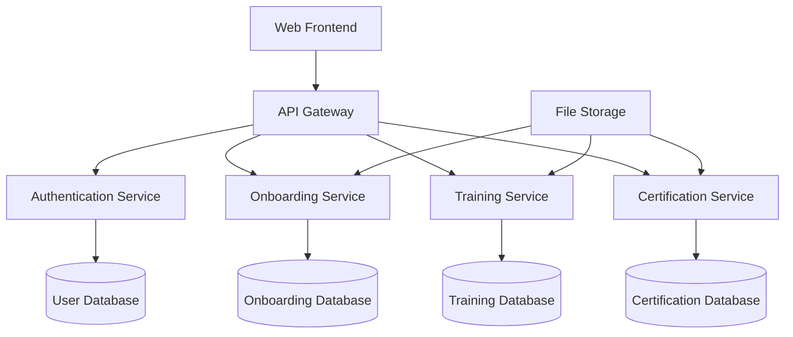

/**
@mainpage Maritime Onboarding System Documentation

@tableofcontents

# 🚢 Welcome to Maritime Onboarding System

The Maritime Onboarding System is a comprehensive platform for managing crew training, certification, and onboarding workflows in the maritime industry.

## 📚 Documentation Sections

### 🔧 API Reference
Complete technical documentation auto-generated from source code:
- **Classes & Interfaces**: Detailed class documentation with inheritance diagrams
- **Functions & Methods**: Complete function reference with parameters and return values  
- **Code Examples**: Interactive examples and usage patterns
- **Search**: Full-text search across all API documentation

### 👥 User Guides
Step-by-step guides for different user roles:
- @subpage getting-started
- @subpage admin-guide  
- @subpage manager-guide
- @subpage crew-guide

### 🚀 Deployment & Operations
Production deployment and maintenance:
- @subpage deployment-guide
- @subpage security-guide
- @subpage troubleshooting

### 🔒 Security & Compliance
Security implementation and maritime compliance:
- @subpage security-architecture
- @subpage encryption-guide
- @subpage compliance-guide

## 🚀 Quick Start

1. **Installation**: Follow the @ref deployment-guide for setup instructions
2. **Configuration**: Configure your environment using the admin guide
3. **First Login**: Use the @ref getting-started guide for initial setup
4. **API Access**: Explore the API reference for integration

## 🏗️ System Architecture

## 🔗 Key Features

- **🔐 Secure Authentication**: Multi-factor authentication with role-based access
- **📋 Digital Onboarding**: Streamlined crew onboarding workflows
- **🎓 Training Management**: Comprehensive training tracking and certification
- **📊 Analytics Dashboard**: Real-time insights and reporting
- **🌐 Multi-language Support**: International crew support
- **📱 Mobile Responsive**: Works on all devices and platforms

## 🛠️ Technology Stack

- **Backend**: Node.js, Express.js, TypeScript
- **Database**: Supabase (PostgreSQL)
- **Frontend**: React, TypeScript, Tailwind CSS
- **Authentication**: Supabase Auth with RLS
- **File Storage**: Supabase Storage
- **Documentation**: Doxygen, Markdown

## 📞 Support & Resources

- **GitHub Repository**: [shipdocs/employee-onboarding](https://github.com/shipdocs/employee-onboarding)
- **Issue Tracker**: [Report bugs and feature requests](https://github.com/shipdocs/employee-onboarding/issues)
- **Security**: Report security issues to security@maritime-onboarding.com
- **Documentation**: This comprehensive documentation site

## 🏷️ Version Information

- **Current Version**: 2.0.0
- **API Version**: v2
- **Last Updated**: @date
- **Generated**: @datetime

---

*This documentation is automatically generated from source code and maintained by the development team.*
*/
